import LeadMagnet from '../../../../components/blog/LeadMagnet.astro';
import Tldr from '../../../../components/blog/Tldr.astro';

<Tldr
  lang="en"
  items={[
    "For Google, quality is effort, originality, talent or skill, and accuracy. It's judged the same whether a person or an AI wrote the content.",
    "Commodity content is content anyone could have written: if you swap your brand for a competitor's and the page is still just as useful, it's commodity.",
    'Quality is attached to each URL before anyone searches. Core updates apply page by page, but that quality also inherits signals from the whole site, which is why weak pages drag down the good ones.',
    'Recovering from a core update takes 3 to 6 months on average. With a low-quality site, Google can take months to index you, or never do it.',
    'What to do: group your URLs by page type, run them through the four pillars and improve, consolidate or remove the commodity.',
  ]}
  link={{ text: "Take me straight to the skill that audits a site's quality", href: '#skill' }}
/>

In early October I was at the Search Central Live Deep Dive Europe 2026 that Google ran in Barcelona. Three days of talks with people from Search, and one of them was about quality, given by Duy Nguyen, Search Quality Analyst and one of the people who lead the anti-spam teams.

Quality is the topic that worries me most on big sites. I almost never see a big site that wants to do things wrong. What I see is a site that stretches. There's a traffic target, you open another category, another page type, another content cluster, and every step looks reasonable. One day you've gone too far, a core update arrives and hits you.

Core updates affect sites of any size. But big ones tend to move more often, because they have more ways to stretch: more page types, more languages, more sections opened to capture traffic. You'll see it in the examples in this post.

And the timing couldn't be better: on October 1, a day before the event ended, Google updated its documentation on [helpful, reliable, people-first content](https://developers.google.com/search/docs/fundamentals/creating-helpful-content) with the same concepts from the talk. What was said in Barcelona is now in writing ([Marie Haynes sums it up well](https://www.mariehaynes.com/main-content/)).

I posted photos of the talk's slides on X, [here](https://x.com/NachoMascort/status/2105983838228799986) and [here](https://x.com/NachoMascort/status/2105983905161417092).

Let's see what quality is for Google, how it measures it and how long it takes to show.

## What is quality for Google?

The definition on the slide was this:

> The extent to which a human being put effort, originality, talent, skill, and accuracy into creating content.

If you've read the [Search Quality Rater Guidelines](https://static.googleusercontent.com/media/guidelines.raterhub.com/en//searchqualityevaluatorguidelines.pdf) it will sound familiar: it's a short version of section 3.2, "Quality of the Main Content". The guidelines say the quality of the main content is determined by the effort, originality and talent or skill behind it, and that for informational and YMYL topics accuracy matters too.

Watch out for a distinction many people mix up. The guidelines separate two things:

- **Page Quality**: how good the page is in itself. It doesn't depend on the query.
- **Needs Met**: how well that page answers a specific search.

A page can have very high quality and be useless for a query. The guidelines put it like this: "Useless is useless". Quality is the part that doesn't depend on the query, and that's why it affects everything you rank for at once.

I wrote a [guide to the Quality Raters](/blog/guia-quality-raters-google/) (in Spanish) years ago. The basics are still there, but the weight they carry has changed a lot.

## The four pillars of quality

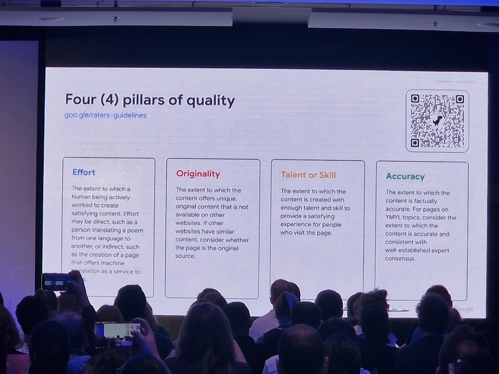

### Effort

> The extent to which a human being actively worked to create satisfying content.

Effort can be direct, like a person translating a poem, or indirect, like building a machine translation tool that provides a service. What the guidelines make clear is the opposite case: generating thousands of pages by running free content through a translator with no supervision or curation **doesn't count as effort**.

Here's the interesting part. In the May 2024 [Content Warehouse API leak](https://ipullrank.com/google-algo-leak) there's an attribute called [`contentEffort`](https://google-api-content-warehouse.hexdocs.pm/0.4.0/GoogleApi.ContentWarehouse.V1.Model.QualityNsrPQData.html), described as "LLM-based effort estimation for article pages". That this field is the algorithmic version of the effort pillar is my own inference, but it's hard not to see it.

On a big site, effort turns into uncomfortable questions. How many of your pages has a person touched? How many come out of a feed and a language model with nobody reviewing them?

### Originality

> The extent to which the content offers unique, original content that is not available on other websites. If other websites have similar content, consider whether the page is the original source.

The second sentence is the one that matters. If your content exists on 50 other sites, the question becomes who published it first.

Google has a patent that circles this idea, the one on [information gain](https://patents.google.com/patent/US11354342B2/en): it scores how much new information a document adds compared to what the user has already seen and reorders the results based on that. The leak also has an `OriginalContentScore`, although it only shows up on pages with little content.

If you copy or rewrite what's already out there, the system has no reason to show you. I said it in the post on [thin content](/blog/que-es-thin-content/) (in Spanish): copying is how you get hit by Panda. Now the bar is contributing something nobody else has.

### Talent or skill

> The extent to which the content is created with enough talent and skill to provide a satisfying experience for people who visit the page.

This is the most subjective one. Google's new documentation adds a nuance I like: not all content needs an expert. A personal experience doesn't require credentials. A technical article does require someone who knows the topic.

### Accuracy

> For informational pages, consider the extent to which the content is factually accurate. For pages on YMYL topics, consider the extent to which the content is accurate and consistent with well-established expert consensus.

In YMYL, besides being correct, you have to be aligned with expert consensus. The October 1 documentation specifically warns about unreviewed AI hallucinations.

### What about AI?

Duy made it clear in the talk: quality is judged the same whether the content comes from a person or a model. The guidelines put it in these words in section 4.6.6: "the use of Generative AI tools alone does not determine the level of effort or Page Quality rating".

The problem is a different one. AI makes producing mediocre content at scale free, and that is exactly what the four pillars penalize. The new documentation also adds **deceptive authorship**: made-up author profiles, AI-generated photos or fake credentials are now an explicit low-quality signal.

<LeadMagnet lang="en" source="google-quality-core-updates" id="skill" />

## What is commodity content?

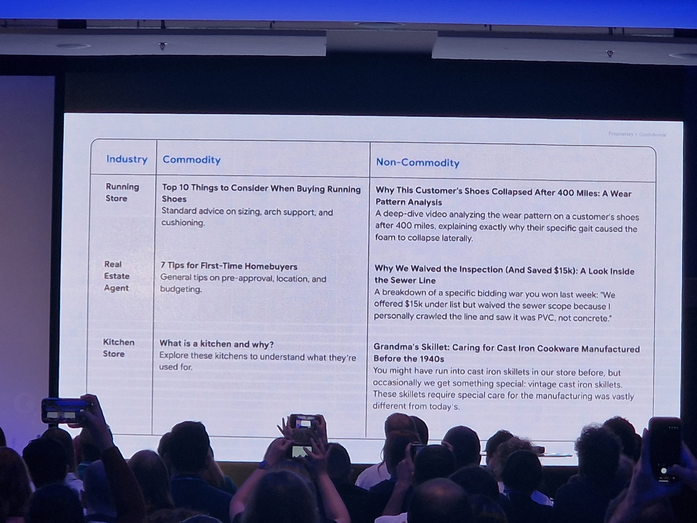

This slide was one of the best of the event. Commodity content is content anyone could have written, because it's based on common knowledge:

| Sector | Commodity | Non-commodity |
|---|---|---|
| Running store | Top 10 things to consider when buying running shoes | Why this customer's shoes bottomed out at 400 miles: a wear analysis |
| Real estate agent | 7 tips for buying your first home | Why we skipped the inspection (and saved $15,000): a look at the plumbing |
| Kitchen store | What is a kitchen and what is it for? | Grandma's skillet: how to care for cast iron made before 1940 |

The term is already official language. Google uses it in its [guide to optimizing for AI](https://developers.google.com/search/docs/fundamentals/ai-optimization-guide) with the same home-buying tips example, and says that creating unique, useful content will influence your presence in generative search over the long term more than any other recommendation in the guide.

On a big site, commodity is almost never a single post. It's a whole page type. It's the 3,000 "what is X" pages generated to cover long tail, the product pages with the manufacturer's description, the city landing pages that only change the name. Each one looks harmless on its own. Together they tell Google your site is interchangeable.

## Content breadth: the index keeps growing

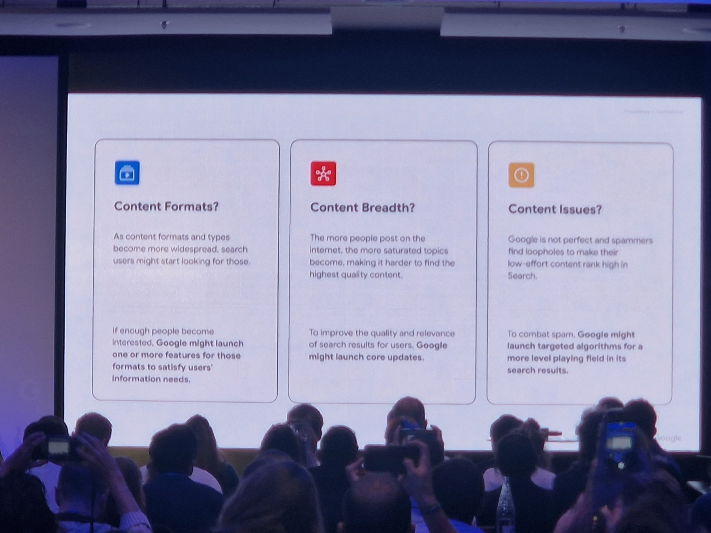

This slide explains why core updates exist. Google updates its systems for three reasons:

1. **Content formats**: new formats appear, people search for them and Google launches features for them.
2. **Content breadth**: the more people publish, the more saturated topics get and the harder it is to find the best. To improve quality and relevance, Google launches core updates.
3. **Content issues**: spammers find holes and Google launches specific algorithms against them.

The second point is the one I care about. Look at these two slides:

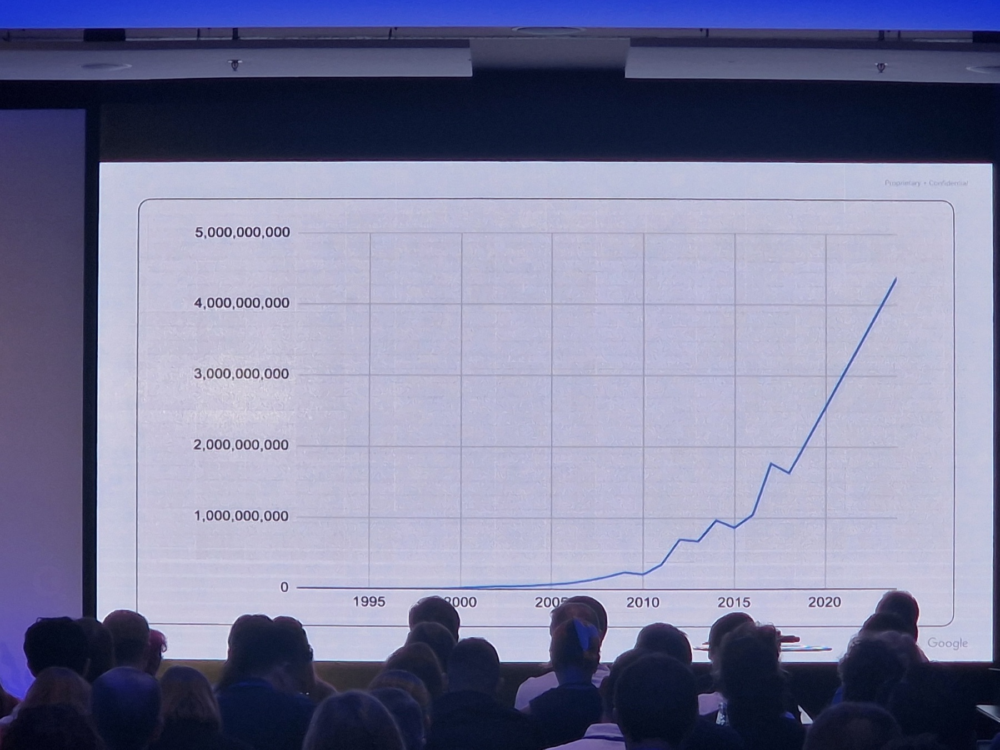

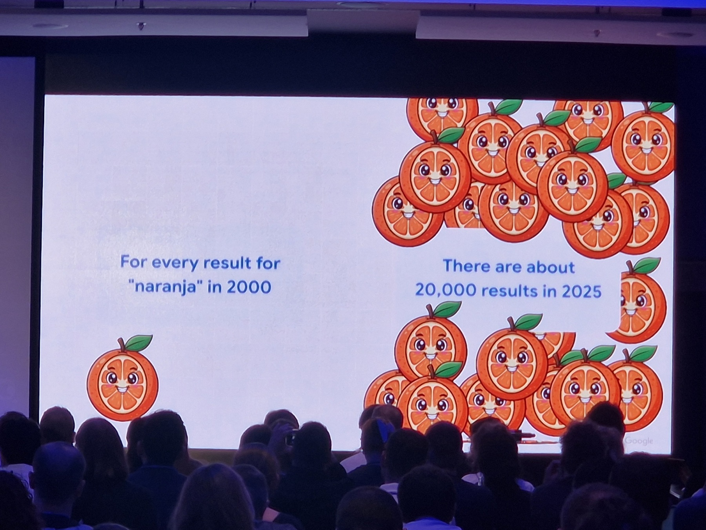

For every result there was for "naranja" (Spanish for orange) in the year 2000, there are about 20,000 in 2025. I've only seen this data in the slides and haven't found a public source, so take it for what it is: what Google showed in the room.

Think about it from Google's side. If the number of candidates for a query is multiplied by 20,000, the bar to get into the top ten has to go up. The page that was among the best on a topic five years ago now competes with thousands of new versions, many of them made with AI. Ahrefs [estimated](https://ahrefs.com/blog/what-percentage-of-new-content-is-ai-generated) that 74.2% of new pages in April 2025 had AI-generated content.

The [core updates documentation](https://developers.google.com/search/docs/appearance/core-updates) explains it with a restaurant analogy: if you make a list of the ten best restaurants and update it the following year, some drop without having gotten worse. Better new places have opened.

And Google filters more and more before ranking. The leak has `scaledSelectionTierRank`, a score about serving tiers: Base, Zeppelins and Landfills. That Base is the best and Landfills the worst is a community interpretation, but the name "landfill" leaves little room. Gary Illyes already said in 2024 that [overall site quality has a big influence](https://www.searchenginejournal.com/google-explains-crawled-not-indexed/521321/) on how many URLs you see in "Crawled - currently not indexed", and that Google had stopped indexing many URLs on some sites "because our perception of the site has changed".

The more content there is out there, the more Google filters before it even gets to ranking.

## There isn't a single quality system

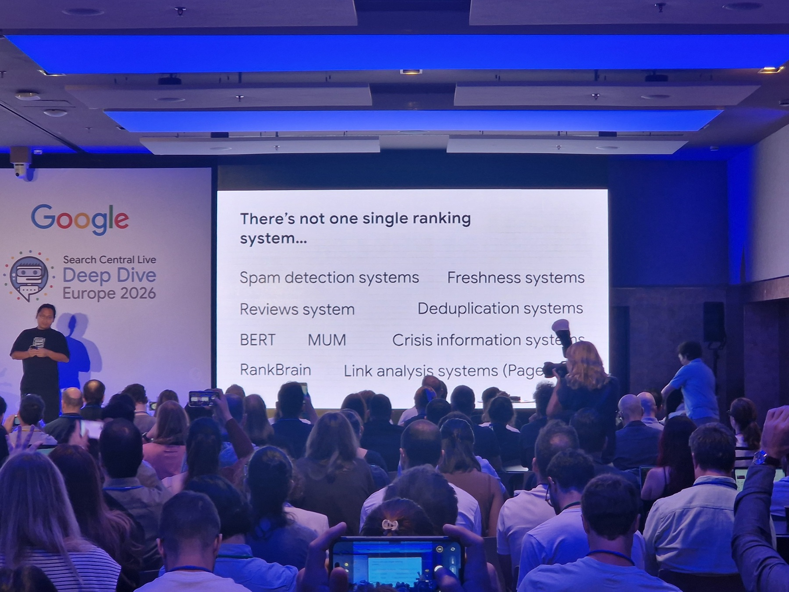

No single "quality algorithm" decides your fate. There are many systems, the ones Google lists in its [guide to ranking systems](https://developers.google.com/search/docs/appearance/ranking-systems-guide). The Helpful Content System, for example, stopped existing as an independent system in March 2024 and became part of the core.

What we do know thanks to the DOJ trial against Google is that there is a page-level quality signal called **Q\***. In the [notes from the interview with Hyung-Jin Kim](https://www.searchenginejournal.com/googlers-deposition-offers-view-of-googles-ranking-systems/546901/), a Search engineer, it's described as "incredibly important" and "generally static across multiple queries and not connected to a specific query". PageRank is one of its inputs.

It fits with what I said earlier about Page Quality: it's a grade you carry into all your queries. In the leak, several fields literally say "applied in Qstar", like `siteAuthority` or `lowQuality`. And the trial also showed that quality signals help decide [how often a page is crawled](https://storage.courtlistener.com/recap/gov.uscourts.dcd.223205/gov.uscourts.dcd.223205.1436.0_4.pdf).

On top of that, Google tests every change relentlessly:

In 2023 they ran 719,326 quality tests, 124,942 side-by-side experiments, 16,871 live traffic experiments and 4,781 launches. The data is also on [their page about testing](https://www.google.com/intl/en_us/search/howsearchworks/how-search-works/rigorous-testing/). Quality raters don't rank pages. Their ratings are used to measure whether a change improves the results.

## Quality travels attached to every URL

In the retrieval talk they showed how Google goes from a query to a list of candidates. With the query "embed a robots.txt file into an audio file", Google splits the search into terms, looks in the index for which URLs contain each one and keeps the ones that match.

The interesting part came after. Each candidate URL arrives with attributes stored in the index. The slide used three of the important ones as an example, language, country and **quality**, but they aren't the only ones Google looks at.

And with those attributes Google reorders. In the next slide, URLs in a language that doesn't fit the user go down and high-quality ones go up:

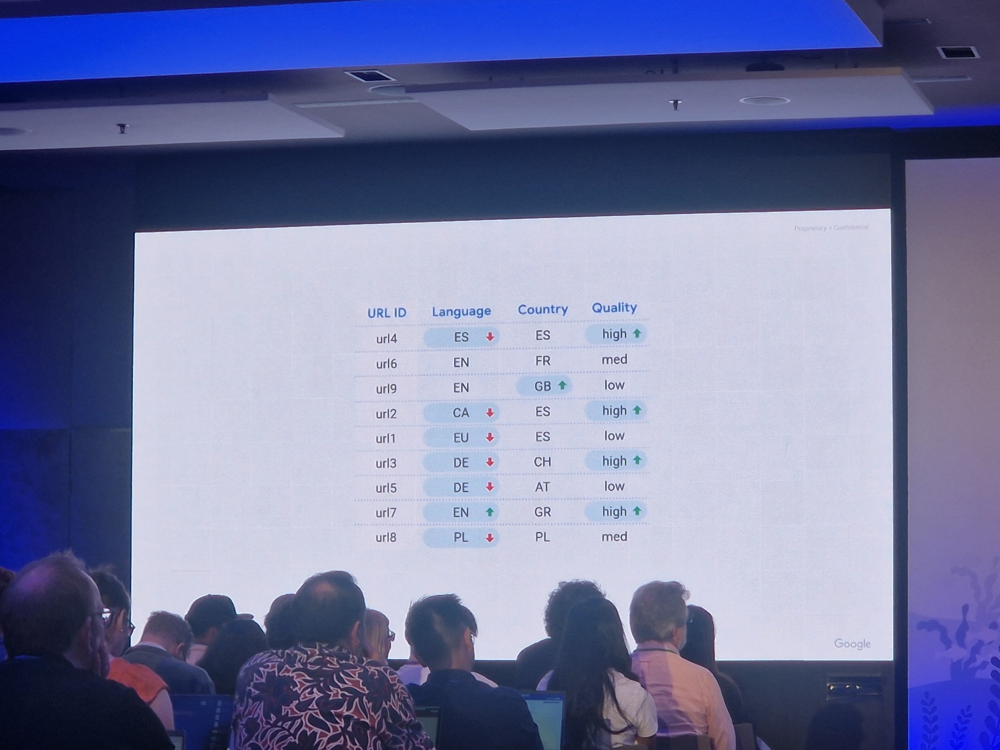

Notice that quality shows up as one more attribute of the URL, next to language or country. It's a value that's already calculated before you run the search. It fits with what Hyung-Jin Kim said about Q\*: a fairly static grade that doesn't depend on the query.

### What about twiddlers?

Twiddlers are the pieces that reorder results after the main ranking. We know this from the [Twiddler Quick Start Guide](https://assets.zachvorhies.com/google_leaks/Fake%20News/Twiddler%20Quick%20Start%20Guide%20-%20Superroot.pdf), an internal Google document from 2018 that leaked in 2019:

> A twiddler is a C++ object that makes ranking recommendations (twiddles) given a provisional search response from a single corpus. Twiddling differs from Ascorer ranking in that twiddlers act on a ranked sequence of results, rather than results in isolation.

Ascorer scores each document separately, and twiddlers look at the whole list and adjust it. They can multiply a result's score (boost), push results out of the first pages, limit how many come from the same host or hide the ones that shouldn't show. The guide says there were "hundreds of twiddlers" and more than 65 active in WebMixer alone.

Do they use quality signals? Some do, and it's documented. In the 2024 leak, `spamtokensContentScore` is used in the `SiteBoostTwiddler` to detect spam in user-generated content, and `hostAge` is used "to sandbox fresh spam in serving time".

From here we get into inferences. Mike King [assumes](https://ipullrank.com/google-algo-leak) that everything ending in "Boost" (NavBoost, QualityBoost, RealTimeBoost) works as a twiddler, and in the leak the Baby Panda demotion is described as "converted from QualityBoost" and "applied on top of Panda". But those fields live in the index (Mustang) and several say "applied in Qstar". The DOJ testimony also places quality and Navboost inside the main scoring.

My reading: quality enters the main ranking through Q\* and there are also adjustment layers on top that use spam and quality signals. That part of a core update's effect shows up in those layers is a reasonable hypothesis, but nobody has documented it.

## What about AI Overviews and AI Mode?

Google explains it in its [guide to optimizing for generative AI features](https://developers.google.com/search/docs/fundamentals/ai-optimization-guide), and it comes down to three ideas:

- **There's no separate trick.** In the guide's words: "You don't need to create new machine readable files, AI text files, markup, or Markdown to appear in Google Search". Google says you don't need an llms.txt, and there's no sign it uses one. To show up, your page has to be indexed and eligible to be shown with a snippet.
- **Answers come from the same index.** AI Overviews and AI Mode use retrieval-augmented generation: they retrieve relevant pages and link the ones that support the answer. They also use query fan-out, where the model runs several related searches at once to get more results.
- **Non-commodity wins.** According to the guide, creating "unique, compelling, and useful" content will likely influence your presence in generative AI search, and its commodity example is the same home-buying tips from the talk.

My reading, and this part is my inference: if answers are built by retrieving pages from the index, quality comes in the same way as in classic results, as an attribute attached to each URL. With fan-out you compete on more queries at once, so a commodity page type loses on all of them. If ten pages say the same thing, the model can cite any of them. If only you have the data, the citation is yours. Google hasn't documented how it picks which source to cite.

To measure it, Search Console has a generative AI performance report.

## The whole journey at a glance

To put all this in context, this is the indexing journey they showed in Barcelona. Index selection is where quality decides what gets stored:

And this is the serving one, where retrieval, ranking and twiddlers come in:

## Does Google evaluate the page or the site?

Both. In the room, Gary Illyes explained that core updates work at page level, not domain level, which is why some pages on a site go up while others go down ([We Are ROAST's day 3 recap](https://weareroast.com/news/google-search-central-live-deep-dive-barcelona-day-3-recap/)). But a page's quality isn't calculated in isolation from its site. We've been seeing it for years on big sites, and the leak is full of site-level signals:

- `siteAuthority`, "applied in Qstar".
- `chardEncoded`, a "site quality predictor based on content".
- `siteFocusScore`, how focused the site is on a single topic.
- `siteRadius`, how far pages stray from the site's central topic.
- `pandaDemotion` and `babyPandaV2Demotion`, "applied on top of Panda".

The Panda patents go the same way: the one on [Ranking search results](https://patents.google.com/patent/US8682892B1/en) calculates a site-level factor, the one on [Site quality score](https://patents.google.com/patent/US9031929B1/en) bases it on how many people search for your brand, and the one on [Predicting site quality](https://patents.google.com/patent/US9767157B2/en) predicts the quality of a new site by comparing its language with that of already scored sites. The core updates documentation itself says the systems have to confirm that "the site as a whole" has improved.

Google ranks pages, but every page inherits the reputation of its site. That's why 5,000 commodity pages end up dragging down the 200 good ones.

## How long does a change take to show?

This is the question I get every time after a core update. Gary showed some slides with timings taken from internal analyses, something Google doesn't usually share in this much detail. [Estela Franco took photos](https://www.linkedin.com/feed/update/urn:li:activity:7512112386334642176/) of all of them:

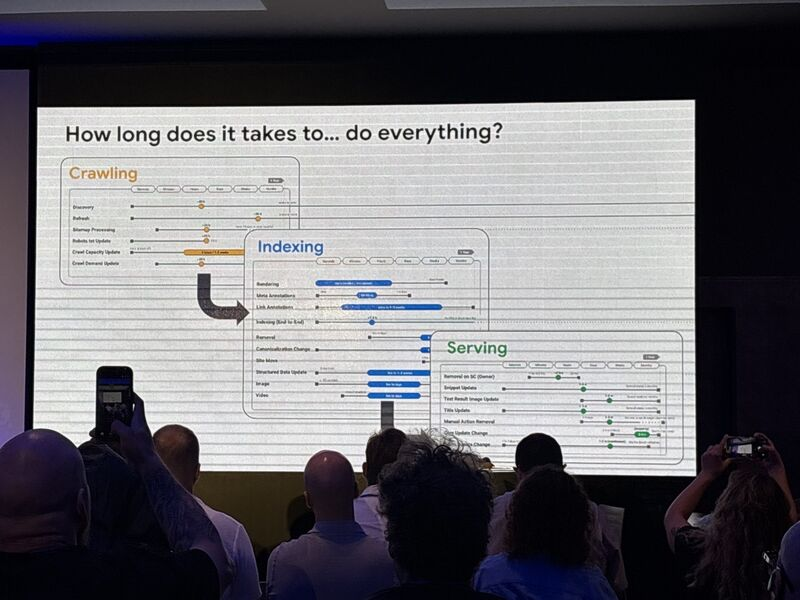
*Photo: [Estela Franco](https://www.linkedin.com/feed/update/urn:li:activity:7512112386334642176/)*

The one that matters for quality is the serving one:

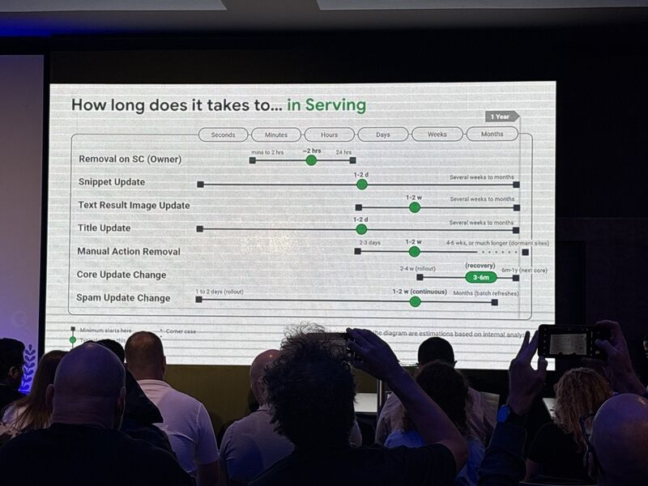
*Photo: [Estela Franco](https://www.linkedin.com/feed/update/urn:li:activity:7512112386334642176/)*

| Change | Typical | Slowest |
|---|---|---|
| Recovery after a core update | 3-6 months | 6 months to 1 year (until the next core) |
| Core update rollout | 2-4 weeks | |
| Spam update | 1-2 weeks (continuous) | Months (batch refreshes) |
| Removing a manual action | 1-2 weeks | 4-6 weeks, or much longer on inactive sites |
| Updating a title or snippet | 1-2 days | Weeks to months |

If you've cleaned up your site after a core update, you already know what's coming: **3 to 6 months on average**, and in the worst case waiting for the next core. The official documentation says the same: it can take several months and "could mean waiting until the next core update".

But what caught my attention most is in the crawling and indexing slides:

*Photo: [Estela Franco](https://www.linkedin.com/feed/update/urn:li:activity:7512112386334642176/)*

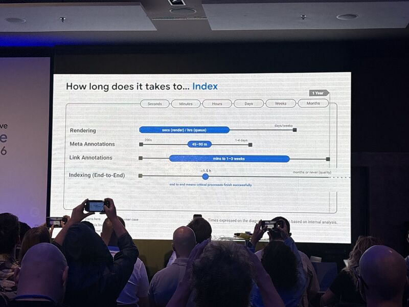
*Photo: [Estela Franco](https://www.linkedin.com/feed/update/urn:li:activity:7512112386334642176/)*

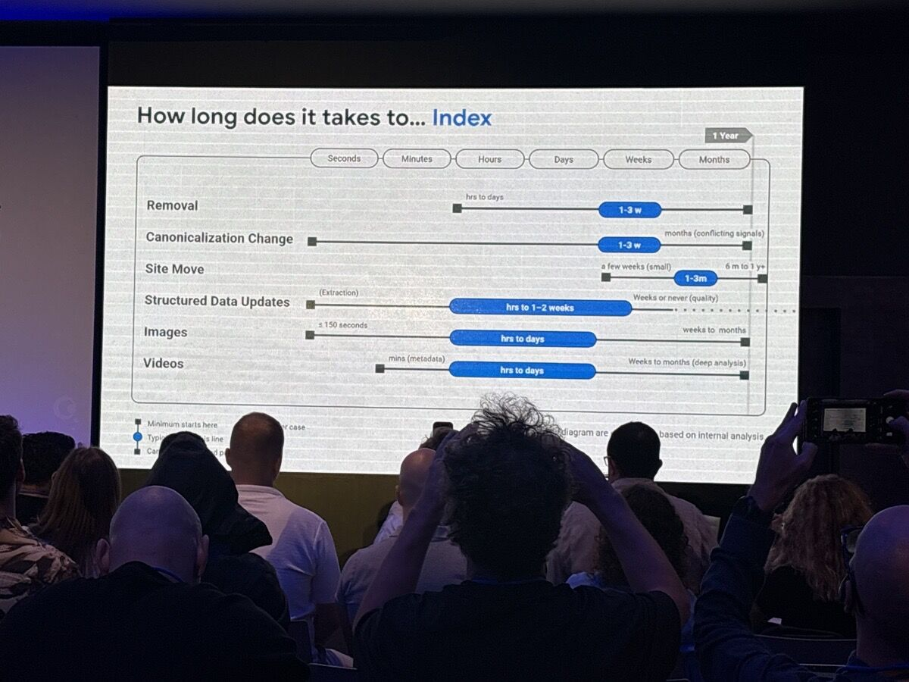
*Photo: [Estela Franco](https://www.linkedin.com/feed/update/urn:li:activity:7512112386334642176/)*

Look at the worst case in three of the rows:

- **Sitemap processing**: about 24 hours, or "up to 14 days or never (quality)".
- **Indexing end-to-end**: an hour and a half, or "months or never (quality)".
- **Structured data updates**: from hours to 1-2 weeks, or "weeks or never (quality)".

Quality shows up in all three. With a low-quality site, Google can take months to index you, ignore your sitemap and not give you rich results, and that's before any core update arrives.

## How does a big site go too far?

Back to the beginning. This can happen to a small site, but a big one has many more levers to stretch. Almost nobody decides to make bad content. What happens is a sum of reasonable decisions:

- **Scaling page types.** A page type that works on 100 pages gets launched on 10,000. The last 9,000 have less data, less demand and more filler text.
- **Opening topics far from your focus.** A tech outlet starts publishing recipes because there's volume. `siteFocusScore` and `siteRadius` measure exactly that.
- **Producing with AI without review.** It's the fastest road to "little to no effort, little to no originality, little to no added value", which is how the guidelines describe Lowest content.
- **Inventing authors.** It's now an explicit signal in the documentation.
- **Covering keywords instead of answering.** The 3,000 "what is X" pages that say the same as the rest of the top 10.

I lived it first-hand at [Softonic](/en/case-studies/softonic-0-to-20-million/). We consolidated the languages, which were on subdomains, into the main domain. At first it worked really well and traffic went up. Then a core update arrived and hit us hard: a 20-something percent drop on a site that gets millions of visits a day.

When we analyzed the possible causes, the conclusion was that the translations, which didn't have the quality of the original content, were lowering the overall quality of the site. By putting them under the same domain, they dragged everything else down.

So we moved the languages to their own ccTLDs, linked to each other with hreflang. Over the following months there was some recovery, and with the next core update the main domain didn't just recover: it went above the levels it had before the consolidation. And the languages, each on its own ccTLD, surpassed the traffic they had when consolidated on the main domain.

It was a complete success, and it was a quality decision: changing which content counted toward the main site's grade.

If you run a big site, this is what I'd review before the next core update:

1. **Group URLs by page type** and look at traffic, indexed percentage and growth for each group. Page types with a lot of "Crawled - currently not indexed" are your first alarm.
2. **Run each page type through the four pillars.** Is there human effort? Does it add something that isn't in the top 10? Was it made by someone who knows the topic? Is it correct?
3. **Look for commodity.** If you can swap your brand for a competitor's and the page is still worth the same, it's commodity.
4. **Improve, consolidate or remove.** What you can't turn into non-commodity, merge with other pages or delete.
5. **Measure in months.** What you do today will show, with luck, in 3 to 6 months.

On 4 October 2026 I ran the skill on my own site, one page of each page type, and the full report is [on the skill's page](/en/skills/google-quality-audit/). The page type that scores worst is the archive of old SEO Hacks posts.

<LeadMagnet lang="en" source="google-quality-core-updates" intro="If you want help with this review, the skill I send you by email does exactly this with each page type:" />

In 2000 it was enough to be an orange. Among the 20,000 of 2025, you have to be the one someone wants to eat.

<aside class="post-module" aria-label="Consulting">

Running a big site?

If you have thousands of URLs and a core update moved your traffic, or you're worried about the next one, I'll review your page types with you and tell you which ones to improve, consolidate or remove. You work with me directly.

[See SEO and GEO consulting →](/en/services/seo-geo-consulting/) · [Book a 30-minute call](https://cal.com/nacho-mascort/30min)

</aside>

