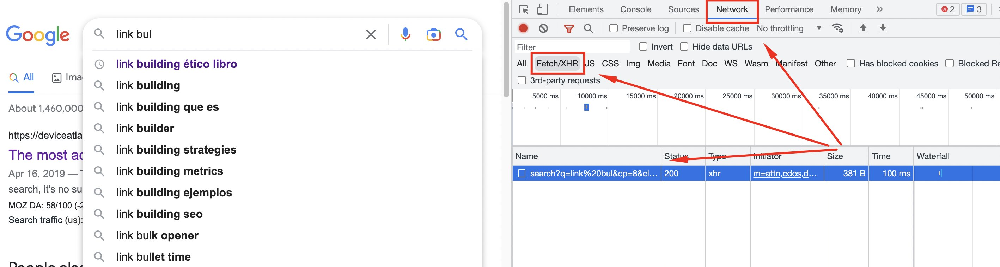
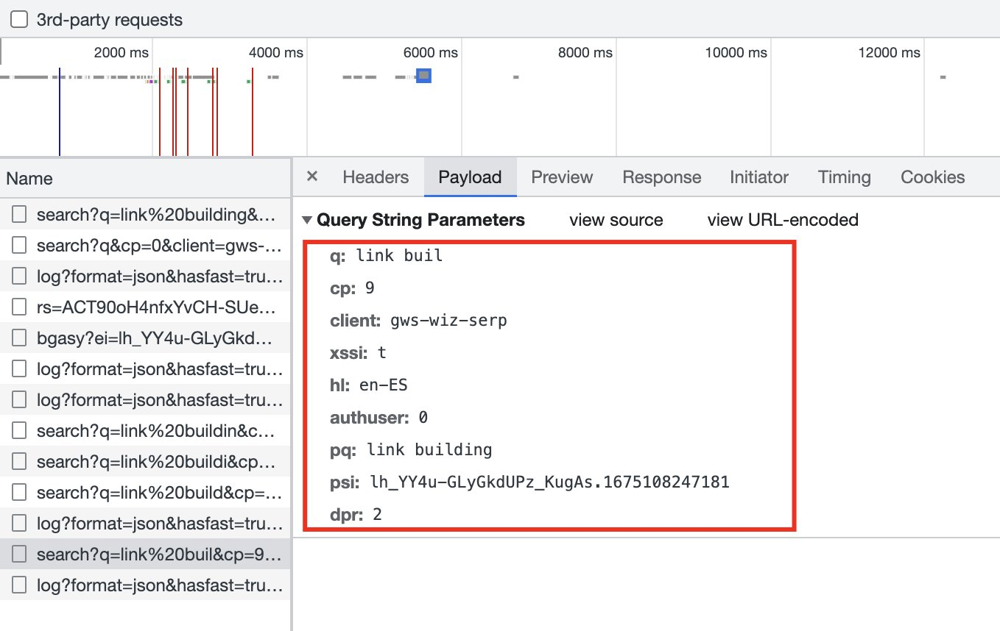
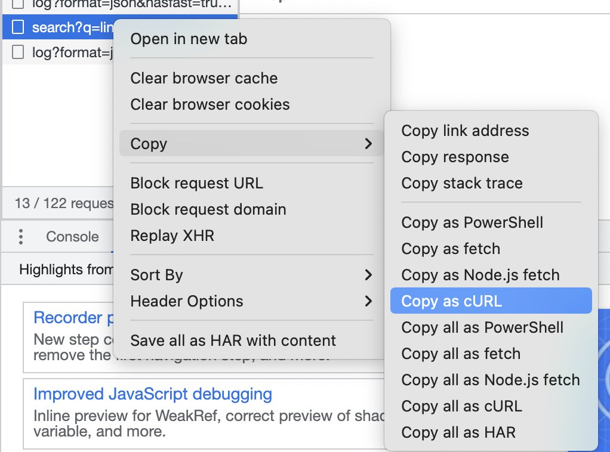
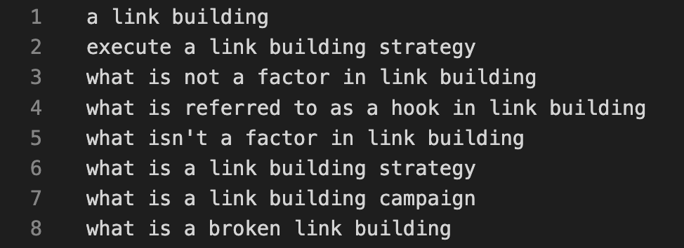

Whenever scraping comes up, XPATH, CSS or RegEx are usually mentioned — but there is another way to extract content from a site: intercepting the calls the site makes to its own services. Let's use Google as the example, for practical reasons obviously.

For those not familiar, scraping is the practice of extracting information from one or several sites. Although its legality is a bit gray, companies of all types do it — Google being the king of it. Googlebot is the most active bot on the internet.

## How can scraping be done without needing the DOM?

### Identify the endpoint calls

Let's take a script I built as the example, which extracts data from Google Autocomplete: [google-autocomplete-extractor](https://github.com/NachoSEO/google-autocomplete-extractor).

The first thing is to see what calls the site makes when certain actions happen. In Google, when you type in the search bar and autocomplete appears, a request is fired to fetch that data. You can see it in Dev Tools → Network → Fetch/XHR.



### Emulate the same payload

Once we've identified the request, we click on it to inspect the payload it sends — the body the endpoint needs in order to return the autocomplete data.



To emulate that call quickly, right-click on the URL and select copy → copy as cURL. Now we have the entire call ready to paste into a terminal.

### Fetch locally with cURL



We paste the call in the terminal to see which elements we need and which we don't, so we can later port it to the language of our choice (Python, NodeJS or another):

```bash
curl 'https://www.google.com/complete/search?q=link%20building&cp=13&client=gws-wiz&xssi=t&hl=en-ES&authuser=0&psi=<REDACTED>&dpr=2' \
  -H 'authority: www.google.com' \
  -H 'accept: */*' \
  -H 'accept-language: es-ES,es;q=0.9,en;q=0.8' \
  -H 'cookie: <REDACTED — your own session cookies go here>' \
  -H 'referer: https://www.google.com/' \
  -H 'user-agent: Mozilla/5.0 (Linux; Android 6.0; Nexus 5 Build/MRA58N) AppleWebKit/537.36 (KHTML, like Gecko) Chrome/110.0.0.0 Mobile Safari/537.36' \
  --compressed
```

The output:

```text
)]}'[[["link building",0,[273]],["link building<b> que es<\/b>",0,[512,203]],["link building<b> ejemplos<\/b>",0,[512,203]],["link building<b> seo<\/b>",0,[512,203]],...]
```

Viewing the terminal like this is a bit like seeing the Matrix, I know. Now we'll change that. We execute the request and the response is a list of terms in Unicode format.

## Decode the Unicode format

To make it readable we can run it through a converter. Now it's a little clearer:


We have the data — now let's make it scalable with NodeJS.

## Scaling the scraping with NodeJS

We transform the cURL request into Axios (a library for making requests). We pass it the query we want information for and the language, to modify the `hl` attribute:

```js
async _requestAutocomplete(query, lang) {
  const res = await this.requestRepository.request({
    url: 'https://www.google.com/complete/search',
    method: 'get',
    params: {
      q: query,
      hl: lang,
      authuser: 0,
      cp: 2,
      client: 'gws-wiz',
      xssi: 't',
      psi: '<session-token>',
      dpr: '1'
    },
    headers: {
      // ...
    }
  })
}
```

Since the response comes in Unicode, we convert and parse the output to get a clean list of terms. The full parsing code is in the [repository](https://github.com/NachoSEO/google-autocomplete-extractor).



## Iterate each letter to obtain more data

Finally, we make the script iterate over each letter of the alphabet, extract the autocomplete for `query + letter` and save the result to a `.txt` file:

```js
async execute(query, lang) {
  const dataP = this.abc.map(letter => {
    return this._requestAutocomplete(`${letter} ${query}`, lang)
  })
  const data = await Promise.all(dataP)
  const queries = this._parse(data)
  this.fileRepository.saveToFile('./src/output/queries.txt', queries.join('\n'))
}
```

We add reading the arguments from the terminal, and voilà — a keyword research source straight from Google's own endpoint, no DOM required.
