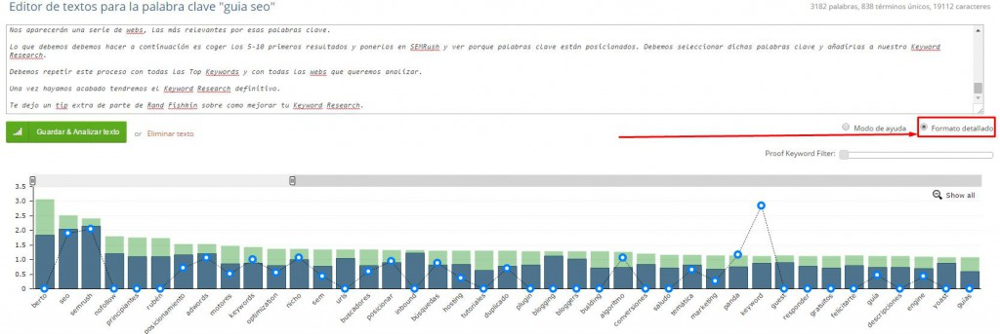

¡Buenas a todos!

Hoy quiero contaros una de las técnicas que mejor me ha funcionado a la hora de posicionar keywords bastante competidas. Lo bueno que tiene esta técnica es que está pensada para mejorar tanto el SEO On Page de tu web como tu estrategia de Link Building.

Lo mejor de todo es que solo necesitarás 2-3 herramientas totalmente gratuitas:

- Seolyze / Onpage.org
- Search Console

La de SEOs que creen que Search Console es una herramienta que sólo sirve para enviar el *sitemap.xml* y para que Google te indexe más rápido. ¡Incrédulos!

Desde que Webmaster Tools cambió su nombre a Search Console e hizo el cambio de funcionalidades en análisis de búsqueda, se ha vuelto una herramienta muy interesante.

Ahora te lo mostraré, vayamos por partes.

## Latent Semantic Indexing

Si no sabes qué es el Contenido LSI estás tardando en leer [este post](http://chuiso.com/keywords-lsi/).

Lo que tienes que saber es que eso de repetir la palabra clave X veces en un texto está más muerto que la meta-etiqueta keywords. Básicamente, las keywords LSI son todas aquellas palabras que están temáticamente relacionadas con el tema principal de tu texto.

Las Keywords LSI pueden ayudarte a mejorar tu On Page ya que consigues un contenido mucho más rico para el usuario y mucho más relevante a ojos de Google.

También son un factor clave para los anchor text ya que mandas enlaces temáticos sin la necesidad de repetir tu Top keyword hasta la saciedad.

## Mejorando el SEO On Page con Onpage.org

En el post que te he enlazado anteriormente (y que deberías haber leído antes de seguir) explica una manera de extraer Keywords LSI así que voy a contarte otra manera para complementar la estrategia que cuenta Chuiso.

Necesitaremos una de las dos herramientas que cuento a continuación: onpage.org o seolyze.com.

Te voy a contar cómo hacerlo, paso a paso, con onpage.org pero ambas funcionan casi igual así que puedes extrapolar el sistema sin problemas.

Para poder utilizar esta herramienta has de registrarte y no te preocupes, es totalmente gratuita, el único “pero” es que la versión gratuita tiene un número de análisis limitado.

Si necesitamos hacer más análisis tendremos que pasarnos a la versión PRO.

Para registrarnos de forma gratuita sólo tenemos que entrar [aquí](https://es.onpage.org/lp/free-seo-analysis/) (sin afiliado, para que veas eh 😉 ) y poner nuestra URL y, a continuación, nuestros datos. Una vez registrados, confirmamos nuestro mail y nos metemos en la herramienta.

Es una herramienta muy completa pero para el post de hoy sólo necesitamos la sección TF\*IDF que se encuentra en la *sidebar* izquierda con forma de lápiz.

### Creando un informe de texto (TF\*IDF)

Para extraer todas las palabras LSI que deberían estar en nuestra página vamos a crear un informe de texto.

Para este caso, emplearé como ejemplo la [guía SEO](/blog/guia-seo/) que estoy escribiendo. Por la amplitud del tema vendrá genial porque esta herramienta me dará ideas sobre qué palabras debería poner en mi guía.

> Lo que hace esta herramienta es lo siguiente: Analiza los 10-20 primeros resultados de Google en función de tu palabra clave y crea un informe con las palabras clave en común de todas las páginas junto con la frecuencia del término en dichas páginas.

1 – Vamos a poner nuestra keyword a posicionar en la casilla de “Palabra Clave”, seleccionamos el idioma y le damos a Crear Informe, en este caso la keyword será: Guia SEO (sin acento).

2 – La herramienta nos creará dos informes: uno analizando los términos individuales más comunes y otro analizando agrupación de dos términos.

3 – También nos muestra las páginas analizadas para crear dicho informe. No sólo nos indica las páginas que coge como referencia para el análisis sino que puedes ver el número de palabras que tiene cada una. De esta manera puedes extrapolar una media de palabras para ese tema.

4 – Aparte del gráfico, Onpage.org también genera un listado completísimo de palabras clave. No hace falta volverse loco, con coger unas cuantas de referencia ya valdrá.

5 – En este punto puedes hacer dos cosas, exportar las keywords e ir añadiendo los términos a tu contenido o puedes usar una característica muy chula de la herramienta: El editor de texto

Incluyes el texto que quieras analizar en función de tu informe y le das al botón verde. Te dará una información muy interesante y fácil de aplicar.

6 – La herramienta te muestra qué términos deberías añadir, cuáles mencionar más a menudo y cuáles deberías mencionar menos. Si pulsamos en “formato detallado” podremos ver una gráfica sobre esto mismo.

A simple vista, estoy abusando muchísimo del término “keyword” por lo que debería reducir el número de veces que aparece, podría usar más el término «palabra clave». Si vemos que no nos cuadra lo que dice el informe siempre podemos acudir a Seolyze para comparar ambos informes.

La herramienta tiene muchas funcionalidades y te recomiendo que juegues con ella ya que descubrirás cosas muy chulas.

> A la hora de añadir tus palabras pon un poco de cabeza, no vayas a stuffear la preposición “de” jajaja

Una vez hayamos aplicado todas las sugerencias de la herramienta pasemos a usar la segunda herramienta para centrarnos en los anchor text.

## Anchor text semánticos para posicionar en 2016

Si has atado cabos te tiene que estar chirriando bastante la idea de usar Search Console como herramienta de Link Building.

La verdad es que con las nuevas funciones que le puso Google verás que es una herramienta bastante potente.

Vamos a extraer qué anchors debemos utilizar en nuestros textos con Search Console.

1 – Lo primero que tenemos que hacer es entrar en la herramienta e ir al proyecto que queremos posicionar. Una vez dentro, vamos a “Análisis de búsqueda”.

2 – Debemos clicar en páginas y seleccionar la página a analizar.

3 – Una vez dentro, clicamos en consultas y nos aparecerán una serie de palabras por las que somos encontrados.

Ahora ya tenemos una selección de palabras clave por las que Google cree que eres relevante y son semánticamente relacionadas con ese contenido. No sólo va bien usarlo como anchor sino que también podemos ponerlo en nuestra página para ganar aún más fuerza.

> Si ves que Search Console te da pocas keywords siempre puedes añadir a la herramienta una página concreta en vez del dominio y verás que el número de keywords se amplía

## Tip de regalo: Enlace replicable

Una vez tenemos la lista de los anchor text creada recomiendo usarlos en estos sitios donde tú también puedes replicar el enlace:

El periódico 20 minutos tiene una sección de listas donde puedes registrarte, crear listas sobre los temas que quieras e incluso poner enlaces en dichas listas.

Dicho esto tenemos dos caminos a seguir, el primero es crear una lista sobre nuestro tema y poner un enlacito. La segunda, la que recomiendo, es la de localizar las listas de autoridad que permitan enlaces y que sean de nuestro mismo tema.

¿Cómo hacemos esto? La respuesta es **Comandos Booleanos + Footprints.**

Pon esto en el buscador y encontrarás tus listas temáticas de autoridad donde poner enlace Do Follow:

*site: listas.20minutos.es «keyword» + «La lista SI admite que otros usuarios añadan nuevos elementos.»*

Si scrapeas los resultados y los pasas por Net Peak podrás sacar las listas con más autoridad de una forma rápida y fácil.

Hasta aquí el post de hoy, espero que sirva para mejorar tu SEO en 2016.

> **Nota (octubre 2026):** Google ha dicho varias veces que no usa Latent Semantic Indexing y que las «keywords LSI» no existen como tal. Lo que sigue teniendo sentido es cubrir bien el tema y usar el vocabulario natural de quien busca. Además, Onpage.org pasó a llamarse Ryte, el informe de Análisis de búsqueda de Search Console es hoy el de Rendimiento, y dejar enlaces en listas abiertas de otros sitios para posicionar es un esquema de enlaces según las [políticas de spam de Google](https://developers.google.com/search/docs/essentials/spam-policies).
