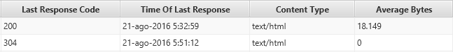

¡Muy buenas a todos!

Hacía meses que no escribía en el blog y ya tocaba volver a pegarle caña.

Sé que prometí subir un post cada dos semanas y no cada dos meses pero he estado bastante liado con lo que se avecina este año jojo

Dejemos de lado las excusas y vayamos al grano.

**Este post pretende ser un poco técnico** así que deja que recule un poco para que puedas seguirlo de principio a fin.

Se ha vuelto bastante de moda el tema de analizar el comportamiento de Googlebot mirando los logs del servidor con el fin de optimizar el posicionamiento web, aunque tengo que adelantarte que no es nada nuevo.

Es una metodología de análisis que lleva años implementándose solo que ahora se ha puesto más de moda; dicho esto, deja que te explique en qué consiste esto de los logs.

## Espiando al espía: análisis de logs

Vamos a empezar por el principio de todo.

Supongo que sabes que las dos funciones principales de Google son la de crawlear e indexar, ¿no? Genial.

La primera de todas consiste en rastrear todo lo que hay en una web y de eso se encargan los mini-espías de Google: las spiders o bots.

**El bot de Google se llama Googlebot**.

Ya te adelanto que tiene varios según la función que desarrolle, hay uno de móvil, otro para las imágenes, de noticias…

En [este listado](https://developers.google.com/search/docs/crawling-indexing/overview-google-crawlers?hl=es) de Google podrás ver todos.

### ¿En qué consiste?

La idea detrás del análisis de logs consiste en espiar cada uno de los pasos que hace Googlebot en nuestro sitio. Cuántas páginas visita, cuáles visita más frecuentemente, cuánto tarda en descargar el DOM (Document Object Model) y un largo etcétera.

Las posibilidades las pones tú.

No solo debes espiar lo que hace el bot, también hay que interpretar datos, tomar decisiones en función de su comportamiento y ver si provoca el efecto deseado o no. Hay que buscar correlaciones entre las modificaciones que se le haga a la web y los cambios de comportamiento de Googlebot.

El objetivo final de todo esto es intentar que el bot pase el mayor tiempo posible en tu web o hacer que crawlee el máximo de páginas posibles dentro de lo que el bot te haya asignado, **a ese presupuesto de rastreo se le llama Crawl Budget.**

Antes de que siga sobre el Crawl Budget necesito que sepas dos cosas básicas: qué es un log y lo que es un código de estado http.

De esta manera podré llevarte a lo que dice el título del post.

### ¿Qué es un log?

Un log es un fichero de texto que almacena información de cada una de las solicitudes que recibe tu web, los logs se encuentran en tu server guardados.

La información bruta de un log puede ser un poco difícil de leer sin emplear ninguna herramienta extra.

Así es como se ve el log abierto a pelo:

```txt
66.249.76.87 - - [21/Aug/2016:04:04:41 +0000] "GET /wp-content/themes/sparkling/style.css?ver=4.4.4 HTTP/1.1" 200 7997 "https://seohacks.es/que-es-thin-content/" "Mozilla/5.0 (Linux; Android 6.0.1; Nexus 5X Build/MMB29P) AppleWebKit/537.36 (KHTML, like Gecko) Chrome/41.0.2272.96 Mobile Safari/537.36 (compatible; Googlebot/2.1; +http://www.google.com/bot.html)"
```

Vamos a desglosarlo por partes para que veas qué significa cada cosa.

- 66.249.76.87 –\> Dirección IP desde donde se realiza la petición al servidor.
- \[21/Aug/2016:04:04:41 +0000\] –\> Fecha en la que se hizo la petición. El +0000 es la zona horaria.
- GET /wp-content/themes/sparkling/style.css?ver=4.4.4 –\> Método y URL a la que se ha accedido
- HTTP/1.1 –\> Protocolo que se ha utilizado
- 200 –\> Código de estado http
- 7997 –\> Tamaño de la respuesta enviada al cliente, en bytes.
- https://seohacks.es/que-es-thin-content/ –\> Origen de la visita. En este caso muestra que proviene de otra página de la misma web
- Mozilla/5.0 (Linux; Android 6.0.1; Nexus 5X Build/MMB29P) AppleWebKit/537.36 (KHTML, like Gecko) Chrome/41.0.2272.96 Mobile Safari/537.36 (compatible; Googlebot/2.1; +http://www.google.com/bot.html) –\> El user agent, en este caso es el robot de Google para Smartphones.

## Códigos de estado http más comunes

Un código de estado http informa de una forma clara sobre una página web.

Hay una gran variedad de códigos. Te dejo aquí la [lista completa](https://www.iana.org/assignments/http-status-codes/http-status-codes.xhtml).

Deja que te introduzca los más comunes:

### 200

OK. Es el código de respuesta estándar.

### 301

Redirección permanente. Realiza un cambio de URL a una nueva URL que ocupará el lugar del contenido antiguo de forma permanente.

### 302 / 307

Redirecciones temporales. Realiza un cambio como en el anterior pero se indica que el cambio es temporal ya que esa no será la URL final.

### 404

Error. Página no encontrada.

### 500

Error de servidor.

## Código de estado http 304

Ahora que ya conoces los más comunes (si es que no lo conocías ya), es el momento de que te presente el **código de estado http 304**.

Los códigos 3XX suelen asociarse a las redirecciones, pero el 304 no redirige a ningún sitio: es el Not Modified.

Cuando Googlebot hace una petición condicional (con la cabecera `If-Modified-Since` o `If-None-Match`) a una página que no ha sido modificada desde su última visita, el servidor puede devolver el código 304. Para eso tu servidor tiene que soportar estas peticiones condicionales. En el caso de que hubiera algún tipo de actualización le devolvería un código 200.

**Lo que esto significa es que cuando se envía una 304, Googlebot no recibe el cuerpo del texto y salta a la siguiente página.** Ajá, ¿ves por dónde van los tiros?

En breve me centraré en cómo el 304 puede optimizar el Crawl Budget pero antes de todo, ¿sabes lo que significa esta palabreja?

## ¿Qué es el Crawl Budget?

El Crawl Budget es la cantidad de URLs que Googlebot puede y quiere rastrear de tu web en un periodo de tiempo. Google lo explica como la suma de dos cosas: la capacidad de rastreo (cuánto aguanta tu servidor sin resentirse) y la demanda de rastreo (cuánto interés tienen tus URLs por popularidad y frecuencia de cambios).

Y tal vez te preguntes que por qué es importante esto, te lo cuento. Ese rastreo es limitado, esto significa que es posible que no pueda rastrear todas las páginas que a nosotros nos interesa.

¿Por qué queremos que Google rastree más veces nuestra página? Porque suele traducirse en un aumento del tráfico orgánico.

Si tu sitio es muy pequeño no tienes por qué preocuparte por ello ya que Googlebot podrá leer todo sin problemas pero si tu sitio tiene un gran número de páginas puede suponer un pequeño problema ya que la araña puede tardar un tiempo hasta percibir todos los cambios en tu site.

No debes preocuparte por este «presupuesto» que te asigna Google, cada segundo del bot puede exprimirse para que te beneficie en tus esfuerzos por mejorar tu posicionamiento web.

## Métodos de optimización del Crawl Budget

Ahora que ya conoces qué es un log, un código de estado y el Crawl Budget es hora de entrar en el meollo del asunto.

Hay muchas maneras de optimizar el Crawl Budget, la máxima es lograr que Googlebot pase por aquellas páginas que más te interese el máximo número de veces.

Hay varias maneras de lograrlo pero yo solo quiero contarte una, la de los estados 304.

Si quieres ver otras maneras de mejorar ese presupuesto [te dejo aquí](https://www.koozai.com/blog/search-marketing/6-ways-to-minimise-wasted-crawl-budget/) un artículo que responderá a tus dudas.

### Optimizando con If-Modified-Since

Por fin llegamos. Cómo me hago de rogar cuando quiero eh 😉

Si no has adivinado ya por dónde van los tiros te lo desvelo, **la idea está en usar los códigos de estado http 304 para ahorrar tiempo de descarga** del Crawl Budget para que Googlebot pueda destinarlo a otras páginas.

Mucha gente emplea el uso de robots.txt para realizar esta tarea pero tiene un inconveniente, la página no será indexada o saldrá la famosa frase de que robots.txt no permite mostrar la descripción. Con el 304 evitamos esto.

Permíteme mostrarte la carga de bytes de una página que retorna un código 200 y otra que retorna un código 304.



Como puedes ver, **la descarga es cero en las 304**.

Esto sucede porque el bot ve que no se ha modificado el contenido desde su última visita y como todo sigue igual no invierte más tiempo en ello y va a otras URLs para rastrear los cambios que hayamos realizado.

A nivel técnico lo que pasa es que al recibir un encabezado 304 el bot no recibe el resto del contenido y entonces prosigue con el rastreo.

## Qué sigue vigente en 2026

- Googlebot sigue soportando las peticiones condicionales: [la documentación de Google](https://developers.google.com/search/docs/crawling-indexing/large-site-managing-crawl-budget) recomienda devolver un 304 cuando el contenido no ha cambiado y responder bien a `If-Modified-Since` y a `If-None-Match` (con `ETag`). La idea de este post sigue siendo buena, siempre que la cabecera `Last-Modified` o el `ETag` cambien de verdad cuando cambia la página.
- Google matiza que el Crawl Budget solo preocupa en webs grandes (más de un millón de páginas, o más de 10.000 que cambian a diario). En una web pequeña no merece la pena obsesionarse.
- Que Google rastree más una página no la hace posicionar mejor por sí solo. El objetivo es que el rastreo llegue a lo que importa y detecte rápido los cambios.
- El robots.txt sigue sin ser una forma de desindexar: bloquea el rastreo, pero la URL puede seguir indexada. Para sacar páginas del índice, `noindex`.
- Googlebot ya no se identifica como Chrome 41: desde 2019 usa una versión actualizada de Chrome, así que el user agent de los logs de hoy es distinto al del ejemplo. Y el informe de Estadísticas de rastreo de Search Console da una vista rápida del rastreo, pero no sustituye a los logs.
