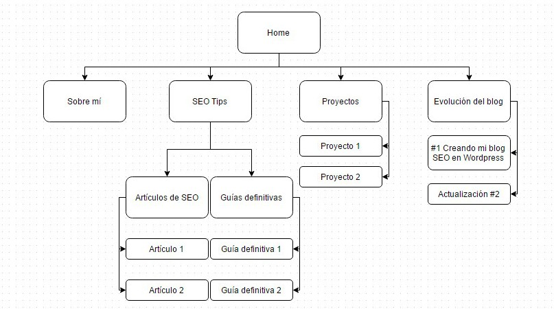

Esta es la primera entrada del blog y de la sección: Evolución del blog.

Como bien indica su nombre, esta serie de posts que realizaré serán una especie de bitácora del blog donde comentaré todas las técnicas SEO que empleo ya sean: **white, grey o black hat**.

En esta serie también podrás ver como va evolucionando seohacks.es mensualmente junto con sus beneficios.

Como este es el primer post de la web, **te invito a que te suscribas** para poder recibir todas las novedades que tengo pendiente publicar a lo largo del año.

Bueno, no me enrollo más, vamos al lío.

## Creando mi blog SEO en WordPress

De todos los CMS existentes, para un blog, **el mejor es [WordPress](https://wordpress.org/)**.

No me voy a meter en las ventajas e inconvenientes de wordpress ya que podría salir un post interminable. Hay una gran cantidad de CMS por ahí, y cada uno está pensado para diferentes tipos de web. Por ejemplo, si tuviera que montar una tienda online no dudaría en usar un [Prestashop](https://www.prestashop.com/es/).

Entre otros CMS famosos nos podemos encontrar a: Magento, Shopify, Joomla… Yo trabajo con WordPress ya que es el que mejor me conozco, no se si lo sabías pero la mayoría de webs están montadas en WordPress.

### Dominio

Elegir un dominio es todo un dolor de cabeza o debería serlo. Depende del dominio que elijamos nos podemos poner las cosas más o menos fáciles en nuestro nicho.

En su día ya escribí un artículo en Tesubi sobre «[Cómo crear un blog en menos de 5 minutos](https://www.google.es/webhp?sourceid=chrome-instant&ion=1&espv=2&ie=UTF-8#q=site%3Atesubi.com+%22C%C3%B3mo+crear+tu+blog+en+menos+de+5+minutos%22)» explicando los tipos de dominios. De los tres tipos que hay me decante por el **dominio de keword parcial**: seohacks.es.

De esta manera me aseguro que Google me considere relevante por temas de SEO, dejo claro a mis usuarios sobre que irá el blog y sobretodo es un término *Brandable.*

Por cierto, si has hecho clic en el enlace anterior te habrás preguntado porque enlazo a una búsqueda de Google en vez de la página en sí, temas de reciprocidad de enlaces.

Si yo le tiro un enlace a Tesubi y ellos me lo tiran a mí, nos quedamos a cero.

**Evita los enlaces recíprocos!**

Si no sabes donde registrar tu dominio te recomiendo:

#### GoDaddy

En GoDaddy puedes registrar tu dominio **.com por sólo 0,99 €**. También tiene otro tipo de cupones de descuento, para ver los disponibles tienes que ir a la pestaña cupones de Godaddy o bajarte una extensión llamada [Honey](https://chrome.google.com/webstore/detail/honey/bmnlcjabgnpnenekpadlanbbkooimhnj) que te realizará el mismo proceso al instante.

[Ir a GoDaddy](https://www.godaddy.com/).

#### DonDominio

Otra web parecida a GoDaddy donde puedes registrar dominios, el panel es muy intuitivo y puedes realizar cualquier gestión en apenas unos minutos.

[Ir a DonDominio](https://www.dondominio.com).

### Hosting

El tema del hosting es otro quebradero de cabeza, llevo semanas buscando hostings que valgan la pena, a buen precio y que ofrezcan un buen servicio técnico.

Después de pelearme con varias compañías creo que si queréis empezar un proyecto web empezad por one.com.

Os recomiendo One, que **es el mismo hosting de seohacks.es**, porque tienen tarifas muy asequibles con tráfico web ilimitado.

Si usas el enlace que te he proporcionado **conseguirás 8 € de bono para tu cuenta** y yo recibiré una pequeña compensación, al tema de la afiliación llegaré después.

Las tarifas de one.com son las siguientes:

Si no te quieres arriesgar en el mundo online, **puedes probar el servicio principiante con tres meses gratis!**

### Temas

Otro de los temas fundamentales de una web es el aspecto que tiene, en el caso de WordPress podemos usar plantillas predefinidas para nuestros diseños. Depende de la función que le quieras dar a la web, habrán plantillas que te puedan ayudar más que otras.

En el caso de seohacks.es la plantilla utilizada es : [Sparkling](https://es.wordpress.org/themes/sparkling/) (plantilla gratuita). Si tuviera que recomendar otra plantilla que se adapta muy bien a casi cualquier proyecto web me decantaría por [Enfold](https://themeforest.net/item/enfold-responsive-multipurpose-theme/4519990) (platilla de pago).

### Estructura

Sobre la estructura de la web, he decidido optimizar el menú para maximizar el linkjuice entre páginas.

La estructura web queda de la siguiente forma:

Según la teoría del linkjuice: cada página de una web tiene una autoridad, digamos que esta autoridad es un líquido. Cada vez que tiramos un enlace, ya sea interno o externo, se crea una tubería que reconduce parte de ese líquido (o autoridad) a la página enlazada.

¿Que pasaría si tuviéramos una página con un menú gigante? Tendríamos un bonito coladero y diluiríamos la autoridad hacia las páginas enlazadas.

Básicamente esto quiere decir que : **Un enlace transmite más autoridad que varios en la misma página**.

### Plugins

Una vez ya tenemos todos los demás elementos escogidos toca añadir los plugins para transformar el blog en un verdadero buque de guerra. Antes de empezar a escribir cualquier post siempre configuro los siguientes plugins:

#### Mailchimp Forms

Herramienta proporcionada por Mailchimp para integrar los formularios de contacto con las listas creadas en Mailchimp. Mailchimp es una web para hacer envíos de emailing de forma fácil e intuitiva.

La versión gratuita permite generar formularios como los que veis en la sidebar.

Mailchimp no solo te deja hacer el envío, sino que te permite generar listas desde cero o importar tus contactos, permite crear mails a partir de plantillas y el seguimiento de cualquier envío es realmente muy intuitivo.

[Ver el plugin](https://es.wordpress.org/plugins/mailchimp-forms-by-mailmunch/)

#### SumoMe

Uno de los obligatorios a tener en un WordPress, no veo que web podría no necesitarlo. Permite realizar todo tipo de acciones a través de sus funcionalidades, generar formularios, añadir iconos sociales tan molones como los que ves a la izquierda, realizar métricas de seguimiento gracias a Analytics…

Otro de los puntos fuertes del plugin es la compatibilidad con otras plataformas.

Aunque sea por curiosidad, pruébalo.

[Ver el plugin](https://sumome.com/)

#### Visual Composer

Todos lo sabemos, el *Drag & Drop* es de lo mejorcito que hay: ahorra tiempo, es muy intuitivo y permite a los usuarios menos avanzados en programación poder trabajar en proyectos online mucho más rápidamente que el método tradicional.

[Ver el plugin](http://codecanyon.net/item/visual-composer-page-builder-for-wordpress/242431)

#### Table of content

Otro de mis preferidos, un plugin super sencillo que te crea una tabla de contenidos en las páginas que le indiques. La tabla de contenidos se muestra justo encima del primer H2 y emplea como estructura los headings de la página.

Otra de las ventajas del plugin es que **facilita la accesibilidad** (factor súper importante SEO) al buscador en sub-apartados de un artículo.

He buscado «extensiones SEO», en el *title* no dice nada pero hay un apartado específico marcado por un *heading* y gracias al plugin *Table of Content* puedo acceder sin problemas.

[Ver el plugin](https://es.wordpress.org/plugins/table-of-contents-plus/)

#### Formulario de contacto 7

Plugin bastante sencillo para crear formularios de contacto. En el apartado Sobre mí podrás ver una aplicación práctica de este.

[Ver el plugin](https://wordpress.org/plugins/contact-form-7/)

#### No Category Parents

Si tienes un WordPress ya te habrás topado con este pequeño problema.

Al crear categorías la URLque se genera aparece de la siguiente forma: **tudominio.com/category/nombre-de-la-categoría**

El /category/ es un problema y debe eliminarse. Puedes hacerlo simplemente instalando el plugin *No Category Parents.*

[Ver el plugin](https://wordpress.org/plugins/no-category-parents/)

## Primeros pasos

Con un dominio escogido, un hosting en funcionamiento y mi plantilla instalada toca realizar los primeros pasos para empezar mi andadura en el vasto océano del Marketing Online.

### Diseñando un logo

He de confesar que una de mis grande debilidades es el diseño, y como **un logo es algo fundamental** para transformar cualquier producto o servicio en una marca reconocible he decidido contar con lo servicios de un gran [diseñador gráfico de Barcelona](https://www.behance.net/piber).

Ahora mismo el logo está en desarrollo, una vez esté terminado os traeré el primer invitado del blog para que os cuente todo sobre el futuro logo de SEO Hacks.

### Configurando Google Analytics

Una de las herramientas más básicas para trabajar, dominarla en su totalidad es todo un reto. Siempre que empiezo un proyecto web pongo mi código de Analytics para empezar a tener métricas de todo lo que pasa en mi sitio.

Para tener listo Google Analytics:

1- Abre Google Analytics y entra en la pestaña de Administrador.

2- Haz clic en el desplegable y dale a «Crear nueva cuenta»

3- Rellena los datos que te piden y dale a «Obtener ID de seguimiento».

4- Copia el código y ponlo dentro de la etiqueta \<head\> de tu web. En WordPress lo podrás encontrar en el archivo *header.php* dentro de apariencia \> editor.

5- Configura Analytics a tu gusto añadiendo vistas sesgadas o creando [dashboards personalizados](https://www.google.com/analytics/gallery/).

### Search Console

Aparte de Google Analytics también necesitamos tener dada de alta la web en [search console](https://www.google.com/webmasters/tools).

El procedimiento es muy sencillo:

1- Haz clic en el botón de «Crear una nueva propiedad»

2- Si has hecho el paso anterior de configurar Google Analytics, verifica tu web mediante Analytics.

3- Sigue los pasos que te recomienda Search Console:

4- Listo!

### Redirección mail

Ya he creado el mail «corporativo» (**nacho@seohacks.es**) al cual **me podéis escribir para cualquier tema** y he configurado los formularios de la web para que lleguen a mi webmail.

También he integrado todos los plugins y cuentas con mi mail personal para gestionar todo desde una misma plataforma.

### Marketing de afiliación

Aquí viene una de las joyas del Marketing Online. El marketing de afiliación consiste en vender productos o servicios de otros a cambio de una comisión o un beneficio.

En este post veréis que solo hay un enlace de afiliación, el de one.com.

El trato con one.com es el siguiente: por cada cliente que les consiga yo recibo 10 € y el cliente recibe un bono de 8€, ganamos todos.

Ya estoy preparando un post con los mejores nichos para ganar dinero a través de afiliación.

Hasta aquí los primeros pasos a la hora de iniciar seohacks.es, me reservo para una segunda parte el resto de acciones que he hecho en la web.

**Si no quieres perderte ningún artículo suscríbete al blog y no te olvides de compartir!**
