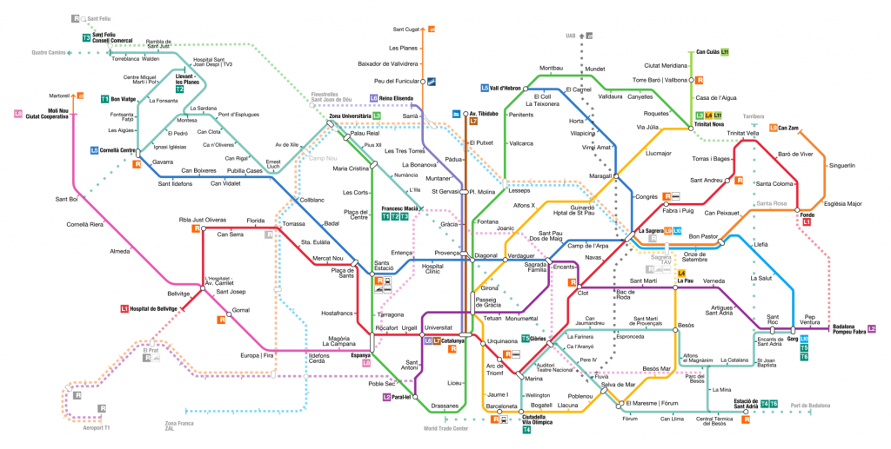
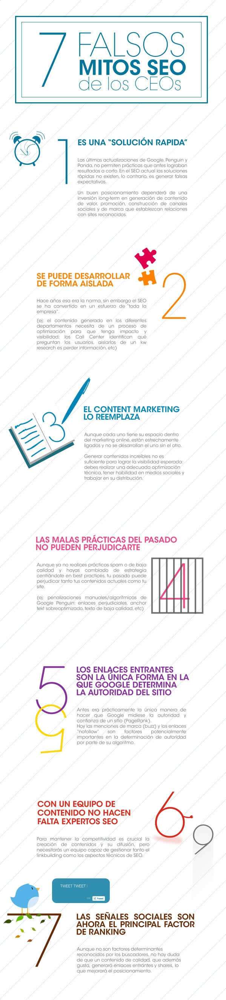
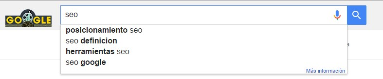

A continuación, os presento la guía SEO más completa (o eso intento conseguir). La siguiente guía se irá desarrollando a lo largo de los meses y ha sido una de las causas por las que no he publicado tanto como me hubiera gustado.

He decidido fraccionar la Guía SEO en 10 apartados que iré publicando a lo largo de estos meses.

En esta guía SEO se tratan todos los temas que debería conocer un profesional del SEO desde lo más básico hasta llegar a los aspectos más avanzados. He de puntualizar que el SEO es una práctica que se va actualizando casi diariamente por lo que iré actualizando esta guía para que no quede desfasada con el tiempo.

La guía se nutre de los conocimientos que he ido adquiriendo a lo largo de los años además de contenido de los grandes SEOs de Internet. También quiero que el feedback de los lectores ayuden a hacerla crecer para que se convierta en un recurso indispensable para cualquier SEO.

> **Guía SEO | Posiciona cualquier web en 2016**
>
> **Conceptos básicos** – (Parte 1/10) Publicado
>
> **Keyword Research** – (Parte 2/10) Publicado
>
> **SEO On Page** – (Parte 3/10) No publicado
>
> **Link Building** – (Parte 4/10) No publicado
>
> **Black Hat** – (Parte 5/10) No publicado
>
> **Contenidos** – (Parte 6/10) No publicado
>
> **SEO Local** – (Parte 7/10) No publicado
>
> **SEO Pasivo** – (Parte 8/10) No publicado
>
> **Herramientas SEO** – (Parte 9/10) No publicado
>
> **Casos de éxito y Recursos** – (Parte 10/10) No publicado

## Conceptos básicos de la Guía SEO

### ¿Qué es el SEO?

SEO se refiere a la siglas «*Search Engine Optimization*» que traducido a nuestro idioma quiere decir: **Optimización en los motores de búsqueda**.

El SEO consiste en realizar toda una serie de acciones, tanto dentro de una web como fuera, para lograr la máxima posición en los buscadores de Internet.

En Internet hay varios motores de búsqueda. Los más usados en escritorio, a nivel mundial, son los siguientes:

En España el buscador por excelencia es Google, con un 96% de uso entre todos los usuarios que usan Internet. Al ser esta cifra tan grande he decidido centrar la guía SEO en Google.

#### ¿Cómo funciona Google?

Hoy en día, Google es una empresa con muchas líneas de negocio pero su producto más importante es el buscador. Google lo que pretende es tener un mapa conceptual de todo Internet.

Esto lo quiere conseguir de la siguiente manera: *Crawleando* internet entera e *indexándola* según unos criterios/factores que determinan la posición de una web por ciertas palabras clave.

Google rastrea todo internet y todas las páginas a las que tiene acceso con sus “arañas” o bots. Tiene más de 74 billones de bots que se encargan de esta tarea.

Su funcionamiento más o menos es el siguiente: Entra en una página y clica en todo para analizarlo y recopilarlo en su base de datos.

Cuando ha recopilado toda una serie de datos, lista los datos (Indexa) en función de unos criterios (algoritmos). Los añade al índice en función de diferentes factores tales como la relevancia y la popularidad… Al final, genera listas en función de lo que busca el usuario.

A continuación podrás ver una cronología de como han ido mejorando el buscador de Google:

#### Tipos de Sombrero

Si en el Taoísmo existe el Ying y el Yang, en el SEO existe algo similar pero con tres vertientes. Las tácticas SEO se pueden clasificar en tres grandes grupos en función de las directrices de calidad de Google.

##### White Hat

Son todas aquellas acciones SEO que cumplen las directrices de calidad de Google. Este tipo de técnicas están basadas en la generación de contenido de calidad con tal de conseguir que otras webs de la misma temática te enlacen y de esta manera aumentar la popularidad de dicha web.

##### Grey Hat

Dentro del *Grey Hat* se encuentran todas aquellas técnicas SEO que no son consideradas *Black Hat* pero sí tienen una cierta intención de manipular los resultados de búsquedas a través de acciones que estarían en el umbral de la duda según las directrices de calidad de Google.

Muchos profesionales del sector aseguran que todo lo que no sea cumplir a rajatabla las directrices de Google puede ser considerado como una técnica *Black Hat*.

##### Black Hat

En el *Black Hat* se encuentran todas aquellas acciones que tienen una clara intención de manipular los Rankings a través de técnicas que quebrantan las directrices de calidad de Google y en algunos casos pueden llegar a ser ilegales según el país en el que te encuentres.

El Black Hat tiene un gran número de adeptos por la facilidad y la rapidez que supone posicionar en ciertos nichos.

#### SEO vs SEM

Uno de los grandes debates dentro del marketing online, yo he de confesar que soy *SEOcentrista.* Casi toda mi estrategia para captar tráfico esta basada en acciones para aumentar el tráfico proveniente de Google.

Para todo aquel que aún tenga dudas sobre cuál de las dos usar, te dejo con unas líneas que escribí sobre este tema en el [blog de Tesubi](http://www.tesubi.com/seo-vs-sem):

> Imaginad que nuestra TOP Keyword es **posicionamiento web**.
>
> Es un término muy competido con un total de 4.400 búsquedas al mes en España, el CPC aproximado de esta palabra clave es de 7€.
>
> Esto quiere decir que si hiciéramos una campaña de Adwords y estuviéramos en primera posición recibiríamos una media de 15 clics diarios, esto conlleva un gasto de 105€ al día por sólo una palabra clave.
>
> Cogemos el número total de búsquedas al mes (4400) y lo dividimos por el número de días que tiene un mes (pondremos que 30), lo que nos da que al día este término se busca unas 147 veces. Teniendo en cuenta el estudio anterior, el porcentaje de clics máximo que puede aspirar un resultado de pago es el 10% de los clics, si está en primera posición.
>
> Por lo tanto, al día podría obtener más o menos 15 clics a un coste de 7€ el clic, que equivale a un total de 105 € por una sola palabra clave. Al mes esto conllevaría un gasto de 3.195€ y reitero lo de UNA sola palabra clave, además del sueldo del profesional que está gestionando la campaña.

### Los 200 Factores SEO que Google tiene en cuenta

Siempre se ha dicho que Google tienen en cuenta más de 200 factores a la hora de posicionar, si bien esto puede ser cierto no debes obsesionarte por tener cada uno de ellos perfecto ya que no todos puntúan igual.

Hay factores que tienen mucha más importancia que otros y estos son los que debemos cuidar al detalle.

A continuación te dejo con una **MEGA-INFOGRAFÍA** con todos los factores que Google tiene en cuenta a la hora de posicionar una web.

Para verla comparte esta guía en redes sociales!

### Google Sandbox

Mucho se ha escrito sobre Google Sandbox. Unos lo niegan y otros lo sufren.

Hay una creencia en el mundo SEO que dice que cuando se crea una nueva web entra en un período de prueba a ojos de Google. Durante este período de prueba la web no rankea casi por ninguna palabra clave interesante en las SERPs.

Yo lo he pasado con todos mis proyectos y aquí te puedo dejar una prueba de ello:

Normalmente Google ha mantenido la mayoría de mis proyectos en Sandbox una media de 2-3 meses dependiendo del nicho.

Como [ya escribí](http://www.tesubi.com/google-sandbox-nueva-web-casi-no-tiene-visitas/) sobre Sandbox en su día, no me voy a explayar mucho sobre este tema.

La mejor manera de salir de Sandbox es siguiendo las directrices de calidad de Google mientras ganas de forma natural interacciones sociales y enlaces sin abusar de anchor text con keyword exacta. También debes vigilar a tus vecinos en tu hosting ya que según que temáticas te puede perjudicar y por último, tener paciencia.

Aprovecha mientras estas en Sandbox para dejar optimizada a nivel On Page toda tu web.

### Mitos SEO

He localizado una infografía sobre mitos SEO que solemos encontrarnos aquellos que trabajamos en el mundo de la agencia.

Te dejo con esta infografía de T2O:

### Algoritmos y penalizaciones

Google tiene una basta cantidad de algoritmos que se encargan de modificar las posiciones de las webs en su índice. Dentro de estos algoritmos cabe destacar 4 con los cuáles un SEO lidiará casi todos los días.

#### Google Panda

Google Panda es el encargado de analizar la calidad del contenido de una web.

Vigila que no haya contenido duplicado ni [Thin Content](/blog/que-es-thin-content/).

El algoritmo de Panda ya está integrado a tiempo real a la hora de analizar una web, esto quiere decir que cada vez que Google rastrea tu web Panda se encarga de analizar todos los puntos pertinentes respecto al contenido On Page.

Las penalizaciones de Panda son al instante, es decir , en el momento que detecta contenido duplicado o Thin Content tu web queda afectada. Esta penalización es algorítmica y nada más se arregle el problema y Google vuelva a pasar por tu web recuperarás los rankings que perdiste por la penalización.

#### Google Penguin

Google Penguin se encarga de analizar todo lo que tiene que ver con los enlaces de una web. Es el algoritmo más temido porque, a diferencia de Panda, no está integrado a tiempo real.

Esto quiere decir que Google Penguin se activa durante unos días, rastrea toda internet y aplica los cambios pertinentes en las SERPs, además de penalizar a quién se ha pasado de listo con ciertas técnicas.

El problema de ser penalizado por Penguin es que tu web no saldrá de la penalización hasta que vuelva a pasar Penguin o eso dice la teoría. En el apartado Black Hat verás un par de Case Study sobre cómo despenalizar una web.

Penguin también es una penalización algorítmica. Había una previsión para actualizar Penguin para Diciembre pero parece ser hasta Marzo no sabremos nada de la nueva actualización.

Dicha actualización transformará a Penguin en un algoritmo que actuará a tiempo real.

#### Hummingbird

Google siempre ha tenido un handicap, el de entender la intención de búsqueda del usuario.

Déjame explicártelo a través de un ejemplo.

Imagina que un usuario pone en Google: Restaurante Barcelona.

¿Qué es más probable que esté buscando, un restaurante que se llama Barcelona o un listado de restaurantes en Barcelona?

¡Exacto! El famoso restaurante Barcelona, va a ser que no.

Pues Hummingbird viene a suplir esto, el objetivo principal es el de entender la intención del usuario al realizar una búsqueda.

#### Pidgeon

Este es el algoritmo encargado del SEO Local.

Pese que la proximidad de un negocio es un factor clave para el posicionamiento Local aún es posible dominar la caja que aparece en las SERPs.

Todo lo referente al SEO Local lo explicaré en el séptimo apartado de esta guía.

### Penalización manual

Aparte de las penalizaciones algorítmicas hay otro tipo que es la manual. La penalización manual sucede cuando un quality rater de Google analiza tu web y detecta que has estado realizando prácticas que incumplen las directrices de calidad de Google.

Sabremos si tenemos una penalización manual si nos aparece un mensaje en Search Console cómo que ha habido una acción manual contra nuestra web.

En el apartado Black Hat de la guía hablaré sobre cómo detectar penalizaciones, clasificarlas y salir de ellas lo antes posible.

### Otros algoritmos

Google tiene una gran variedad de algoritmos y no los menciono todos aquí , solo los más relevantes y los que debes tener en cuenta cuando inicies tu proyecto SEO. Si quieres conocer todos los algoritmos de Google junto con sus actualizaciones deberías [ver esta página](https://moz.com/google-algorithm-change).

## Keyword Research Semántico

Pese a tener un nombre tan «espectacular», a lo que me refiero es que cuando realizamos el Keyword Research no te limites solo al planificador de palabras clave de Adwords.

El planificador es indispensable, pero hay toda una gama de herramientas para extraer más información de un Keyword Research.

Las herramientas que necesitas son las siguientes:

- Planificador de palabras clave
- Ubbersuggest / Keywordtool.io
- Keyword.io
- Foros
- Search Console
- SEMRush / Sistrix

### Planificador de palabras clave

La herramienta por excelencia para realizar los famosos **estudios de palabras clave**. La herramienta de Google está enfocada para las campañas de PPC pero todos los SEOs la usan para sus proyectos.

Desde el *planificador de palabras clave* no sólo podemos extraer el volumen de búsquedas de una palabra clave sino que nos puede mostrar porque palabras clave es relevante una web poniendo su URL.

Podremos extraer ideas para montar un nicho a través de las pujas de ciertas palabras clave y si estamos a usar adwords para promocionar algo nos dará unas estimaciones del gasto según las palabras que queramos emplear.

El planificador está muy bien pero tiene una limitación, sólo muestra palabras estrechamente relacionadas con las palabras que hemos indicado.

Cuando haces una búsqueda sobre SEO solo aparecen palabras muy relacionadas entre sí. Olvídate de recolectar palabras del mismo nicho no tan relacionadas, si las quisieras obtener deberías volver a hacer otro *Keyword Research* sobre ese término.

En algunos casos pensamos que las palabras clave que nos muestra son suficientes pero no.

Las herramientas que os muestro más abajo sirven para complementar y mejorar tu *Keyword Research.* De esta manera, obtendrás **contenido hiper relevante**.

### Ubbersuggest / Keywordtool.io

Herramientas para conseguir ideas en función de una o varias palabras clave.

Lo que hacen estas herramientas es extraer los datos de Google Instant / Auto suggest (las palabras clave relacionadas que sugiere Google cuando un usuario hace una búsqueda).

Ubbersuggest y Keywordtool.io realizan la misma función, es indiferente cuál uses. Ambos usan varios comandos booleanos para extraer listas de palabras clave en orden alfabético.

Te extraen la búsqueda relacionada de todas las letras del abecedario, te lo ejemplifico:

En esta imagen puedes ver las búsquedas de palabras clave relacionadas hechas por los usuarios que buscaban SEO + una palabra que empiece por a, por b, por c…

El uso de estas herramientas es bien sencillo: hay que colocar la palabra clave, seleccionar el idioma del buscador y darle clic para que empiece la retahíla de *keywords*.

Por cierto, si quieres divertirte con una herramienta para generar infinidad de palabras clave no te puedes perder (el nombre es muy descriptivo jaja): [Keyword Shitter](http://keywordshitter.com/).

### Keyword.io

Esta herramienta SEO tiene una función similar a las anteriores pero con un añadido muy interesante que nos ayudará a complementar nuestro *Keyword Research* con **palabras clave semánticamente relacionadas**.

Esta herramienta analiza los primeros resultados de una búsqueda y extrae los términos más relevantes a través de dos métricas: el **TF\*IDF** y el **TextRank**.

#### TF\*IDF

El significado de las siglas es: *Term frequency – Inverse document frequency.*

Vamos a ir por partes para que se entienda todo correctamente.

- **TF (Frecuencia del término)**: Es una métrica que analiza el número de veces que aparece una palabra clave en un texto. Es decir, la densidad de la palabra clave. Quítate de la mente eso de un máximo del 2% de densidad de la palabra clave en un texto, **el porcentaje real te lo da el mercado**. Se calcula cogiendo el número de veces que aparece la palabra clave en el texto y dividiéndolo entre el total de palabras del texto, algo así: .

*TF = Nº de veces que se repite la palabra clave/ Nº total de palabras del texto*

- **IDF (Frecuencia Inversa del documento):** Analiza la frecuencia con la que aparece una palabra clave en relación a todos los textos que hablan sobre esa palabra clave. Hace una especie de media de la densidad con la que aparece esa palabra clave en todos los textos de Internet (la herramienta solo lo hace con los primeros resultados).

*IDF = Sumatorio de todas las palabras de los textos / Nº de veces que se repite la palabra clave en todos los textos*

*TF\*IDF= la densidad media que emplea el mercado/nicho de una palabra clave*

Este número será tu referencia a la hora de tener en cuenta cuantas veces puedes repetir tu palabra clave en un texto además de decirte otras palabras clave semánticamente relacionadas.

Para el *Keyword Research* estas métrica nos viene bien ya que al analizar una palabra clave en la herramienta SEO Keyword.io podemos extraer otras palabras que no paran de repetirse en todos los textos de la misma temática.

#### TextRank

El TextRank es una tecnología que emplea Google como método de extracción automática para recuperar información relevante en los libros almacenados en un formato electrónico.

Si quieres saber más sobre esta tecnología consulta este artículo de [SEObytheSea](http://www.seobythesea.com/2005/12/textrank-and-google-book-search/).

Para extraer términos relevantes en Keyword.io debes introducir tu palabra clave en el buscador y seleccionar el país al que quieres enfocarte.

La herramienta empezará a analizar los resultados que va extrayendo. En el menú de Keyword.io verás que hay diferentes apartados, el que te interesa es *Relevant Terms.* Ahí saldrán las palabras clave indispensables que deberían estar en tu *Keyword Research.*

Para la consulta SEO, los resultados son:

Sólo debemos quitar las *stop words* (artículos, preposiciones…) y añadir el resto de palabras clave a nuestro documento.

Hay herramientas similares a Keyword.io como [Seolyze](https://www.seolyze.com/) u [OnPage](https://es.onpage.org/) que hacen la misma función. Sin embargo, estas herramientas las trataré más adelante cuando lleguemos a la parte de como crear contenido relevante para mejorar el SEO On Page.

### Foros

Una excelente manera de complementar tu Keyword Research si te has quedado sin ideas acudir a foros del sector puede darte un par de palabras clave con las que no habías caído.

Los foros son una buena fuente de información y no solo pueden darte ideas de palabras clave, también pueden ayudarte a definir la estructura de tu web en función de los temas y los subtemas del foro.

También son una fuente excelente de ideas para generar contenido ya que un gran número de usuarios emplea foros para resolver dudas, adelántate a otros escribiendo un post sobre lo que preguntan y compártelo para ganar tráfico.

#### ¿Cómo podemos encontrar foros de la temática que nos interesa?

Fácil, con *footprints.*

Un *footprint* es un patrón que siguen un conjunto de webs y que podemos rastrear gracias a los comando *booleanos* de Google.

*Footprints* básicos para localizar foros:

*Keyword(s) foro*\
*“Keyword(s) foro”*\
*“add comment”*\
*“post comment”*\
*Keyword(s) members*\
*Keyword(s) join*\
*Keyword(s) tag*\
*Keyword(s) group*

Ponlo en el buscador de Google en tu idioma y verás la cantidad de foro que encuentras.

### Search Console

*Search Console* (o *Webmaster Tools* como era llamado antes) nos puede dar una idea de las palabras clave por las que rankea nuestra web.

Para extraer esta información debemos ir a **Tráfico de Búsqueda \> Análisis de la Búsqueda**.

En este apartado veremos las palabras clave por las que aparece la web además de otra información sobre CTR, posición, clics e impresiones. *Search Console*, al igual que Google Analytics, da información sesgada y si queremos extraer aún más palabras clave podemos usar un truco.

Lo que debemos hacer es abrir cuentas de *Search Console* en cada una de nuestras páginas, de esta manera tendremos información más amplia y específica.

A estas alturas ya deberíamos tener un señor *Keyword Research*, pero aún falta un último paso para tener un *Keyword Research* épico y que nos ayude a que nuestro contenido sea mejor que el de otras webs.

### Extrayendo aún más Keywords con SEMRush

Este es el paso de la excelencia para completar nuestro *Keyword Research*.

Para realizar este paso necesitas la herramienta SEMRush.

Regístrate gratis aquí.

Una vez tenemos nuestro documento, debemos seleccionar las que serán las palabras clave de las categorías Top. Una vez seleccionadas, debemos poner esas palabras clave en los resultados de búsqueda de Google.

Nos aparecerán una serie de webs, **las más relevantes por esas palabras clave**.

Lo que debemos debemos hacer a continuación es coger los 5-10 primeros resultados y ponerlos en SEMRush y ver porque palabras clave están posicionados. Debemos seleccionar dichas palabras clave y añadirlas a nuestro *Keyword Research*.

Debemos repetir este proceso con todas las Top *Keywords* y con todas las webs que queremos analizar.

Una vez hayamos acabado tendremos el ***Keyword Research* definitivo**.

Te dejo un tip extra de parte de Rand Fishkin sobre como mejorar tu Keyword Research.

[Ver vídeo](https://fast.wistia.net/embed/iframe/f480p1kftm)

Hasta aquí la segunda parte de la **Guía SEO para posicionar cualquier web en 2016.**
