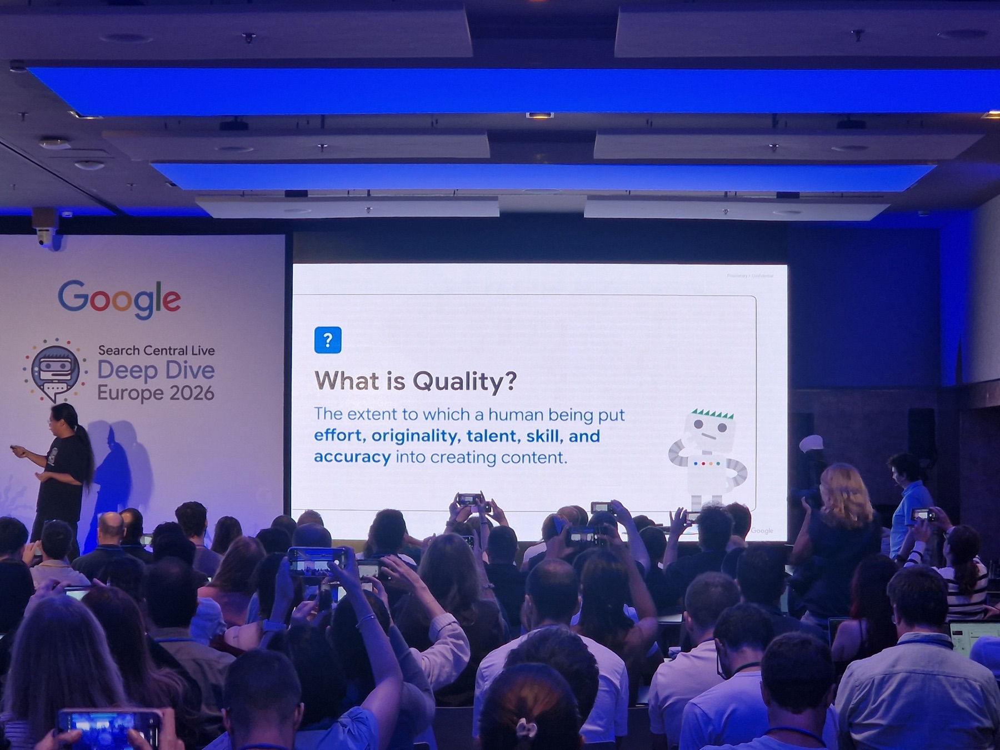
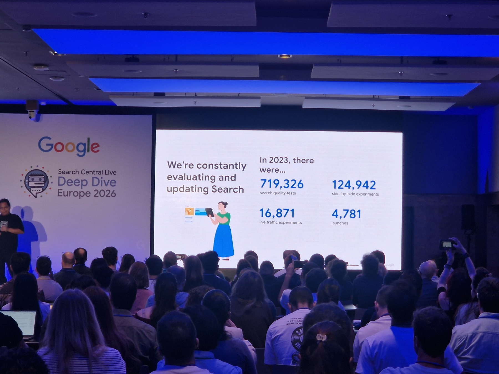
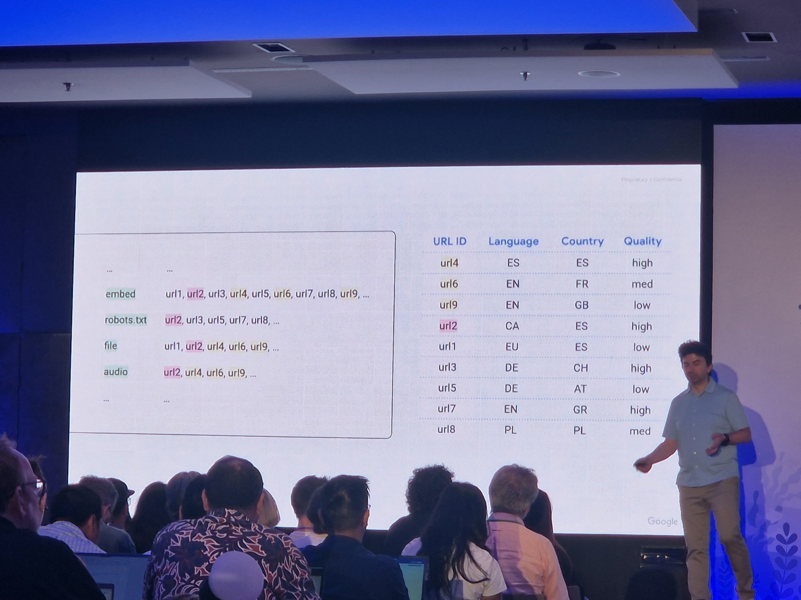
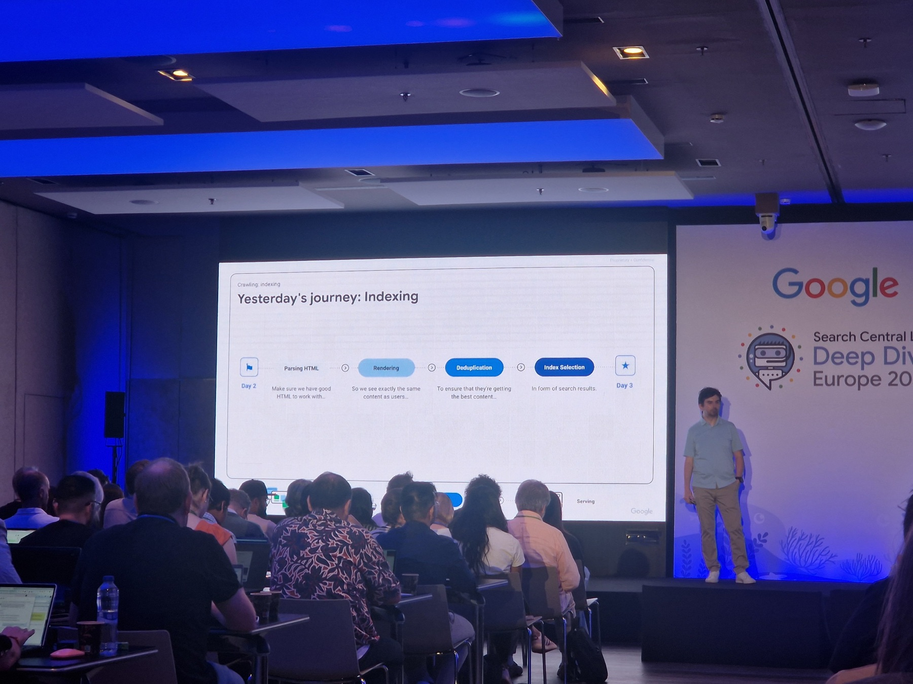
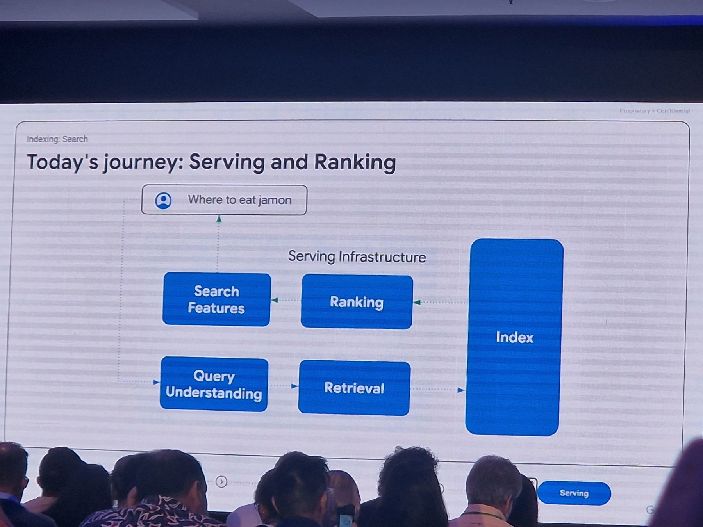
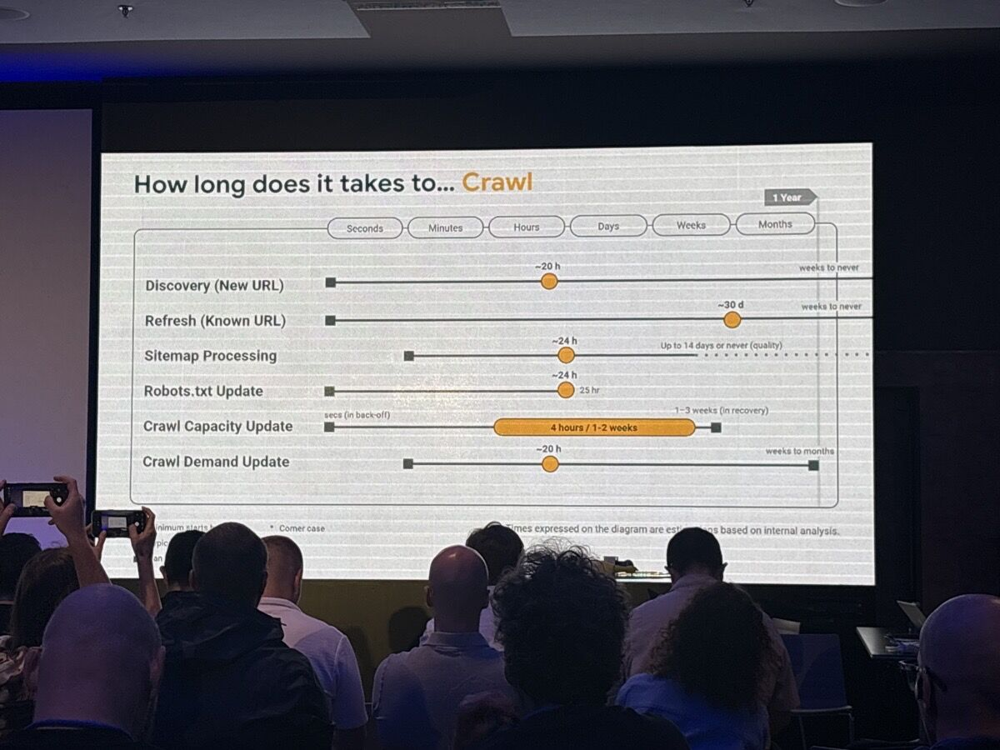

import LeadMagnet from '../../../../components/blog/LeadMagnet.astro';

<aside class="tldr" aria-label="Resumen">

TL;DR Ver resumen

- Para Google, quality es effort, originality, talent o skill y accuracy. Se juzga igual si el contenido lo escribe una persona o una IA.
- El contenido commodity es el que podría haber escrito cualquiera: si cambias tu marca por la de un competidor y la página sigue valiendo igual, es commodity.
- Quality va pegada a cada URL antes de que alguien busque, y los core updates miran el site entero. Las páginas flojas arrastran a las buenas.
- Recuperarse de un core update lleva de 3 a 6 meses de media. Con una web de baja calidad, Google puede tardar meses en indexarte o no hacerlo nunca.
- Qué hacer: agrupa tus URLs por page type, pásalos por los cuatro pilares y mejora, consolida o elimina lo commodity.

[Llévame directamente a la skill que evalúa la quality de un site →](#skill)

</aside>

A principios de octubre estuve en el Search Central Live Deep Dive Europe 2026 que Google montó en Barcelona. Tres días de charlas con gente de Search, y una de ellas fue sobre quality, de la mano de Duy Nguyen, Search Quality Analyst y una de las personas que lleva los equipos de anti-spam.

Quality es el tema que más me preocupa en webs grandes. Casi nunca veo una web grande que quiera hacer las cosas mal. Lo que veo es una web que se estira. Hay un objetivo de tráfico, abres otra categoría, otro page type, otro cluster de contenido, y cada paso parece razonable. Un día te has pasado de la raya, llega un core update y te pega.

Los core updates afectan a webs de cualquier tamaño. Pero las grandes suelen moverse más a menudo, porque tienen más formas de estirarse: más page types, más idiomas, más secciones abiertas para captar tráfico. Lo verás en los ejemplos de este post.

Y el momento no puede ser mejor: el 1 de octubre, un día antes de que acabara el evento, Google actualizó su documentación de [contenido útil, fiable y centrado en las personas](https://developers.google.com/search/docs/fundamentals/creating-helpful-content) con los mismos conceptos de la charla. Lo que se contó en Barcelona ya está por escrito ([Marie Haynes lo resume bien](https://www.mariehaynes.com/main-content/)).

Las fotos de los slides de la charla las colgué en X, [aquí](https://x.com/NachoMascort/status/2105983838228799986) y [aquí](https://x.com/NachoMascort/status/2105983905161417092).

Vamos a ver qué es quality para Google, cómo lo mide y cuánto tarda en notarse.

## ¿Qué es quality para Google?

La definición del slide fue esta:

> The extent to which a human being put effort, originality, talent, skill, and accuracy into creating content.

Si has leído las [Search Quality Rater Guidelines](https://static.googleusercontent.com/media/guidelines.raterhub.com/en//searchqualityevaluatorguidelines.pdf) te sonará: es una versión resumida de la sección 3.2, "Quality of the Main Content". Las guidelines dicen que la calidad del contenido principal se determina por el esfuerzo, la originalidad y el talento o habilidad que hay detrás, y que en temas informativos y YMYL además importa la precisión.

Ojo con una distinción que mucha gente mezcla. Las guidelines separan dos cosas:

- **Page Quality**: lo buena que es la página en sí. No depende de la query.
- **Needs Met**: lo bien que esa página responde a una búsqueda concreta.

Una página puede tener una calidad altísima y no servir para nada en una query. Las guidelines lo dicen así: "Useless is useless". Quality es la parte que no depende de la query, y por eso afecta a todo lo que rankeas a la vez.

Ya escribí hace años una [guía de las Quality Raters](/blog/guia-quality-raters-google/). Las bases siguen ahí, pero el peso que tienen ha cambiado mucho.

## Los cuatro pilares de quality

### Effort

> The extent to which a human being actively worked to create satisfying content.

El esfuerzo puede ser directo, como una persona traduciendo un poema, o indirecto, como construir una herramienta de traducción automática que da un servicio. Lo que las guidelines dejan claro es lo contrario: generar miles de páginas pasando contenido gratuito por un traductor sin ninguna supervisión ni curación **no cuenta como esfuerzo**.

Aquí viene lo interesante. En el [leak de la Content Warehouse API](https://ipullrank.com/google-algo-leak) de mayo de 2024 aparece un atributo llamado [`contentEffort`](https://google-api-content-warehouse.hexdocs.pm/0.4.0/GoogleApi.ContentWarehouse.V1.Model.QualityNsrPQData.html), descrito como "LLM-based effort estimation for article pages". Que ese campo sea la versión algorítmica del pilar de effort es una deducción mía, pero cuesta no verlo.

En una web grande, effort se traduce en preguntas incómodas. ¿Cuántas de tus páginas ha tocado una persona? ¿Cuántas salen de un feed y un modelo de lenguaje sin que nadie las revise?

### Originality

> The extent to which the content offers unique, original content that is not available on other websites. If other websites have similar content, consider whether the page is the original source.

La segunda frase es la que importa. Si tu contenido existe en otras 50 webs, la pregunta pasa a ser quién lo publicó primero.

Google tiene una patente que le da vueltas a esto, la de [information gain](https://patents.google.com/patent/US11354342B2/en): puntúa cuánta información nueva aporta un documento respecto a lo que el usuario ya ha visto y reordena los resultados en base a eso. En el leak también hay un `OriginalContentScore`, aunque solo aparece en páginas con poco contenido.

Si copias o reescribes lo que ya hay, el sistema no tiene ningún motivo para enseñarte a ti. Ya lo decía en el post de [thin content](/blog/que-es-thin-content/): copiar es Pandazo. Ahora el listón está en aportar algo que no tenga nadie más.

### Talent or skill

> The extent to which the content is created with enough talent and skill to provide a satisfying experience for people who visit the page.

Este es el más subjetivo. La documentación nueva de Google añade un matiz que me gusta: no todo el contenido necesita un experto. Una experiencia personal no requiere credenciales. Un artículo técnico sí requiere a alguien que sepa del tema.

### Accuracy

> For informational pages, consider the extent to which the content is factually accurate. For pages on YMYL topics, consider the extent to which the content is accurate and consistent with well-established expert consensus.

En YMYL, además de ser correcto, tienes que estar alineado con el consenso de los expertos. La documentación del 1 de octubre avisa en concreto de las alucinaciones de IA sin revisar.

### ¿Y la IA?

Duy lo dejó claro en la charla: la calidad se juzga igual venga el contenido de una persona o de un modelo. Las guidelines lo dicen con estas palabras en la sección 4.6.6: "the use of Generative AI tools alone does not determine the level of effort or Page Quality rating".

El problema es otro. La IA hace que producir contenido mediocre a escala sea gratis, y eso es exactamente lo que penalizan los cuatro pilares. La documentación nueva añade también la **autoría engañosa**: perfiles de autor inventados, fotos generadas con IA o credenciales falsas son ahora una señal explícita de baja calidad.

<LeadMagnet lang="es" source="quality-google-core-updates" id="skill" />

## ¿Qué es el contenido commodity?

Este slide fue de lo mejor del evento. Contenido commodity es el que podría haber escrito cualquiera, porque se basa en conocimiento común:

| Sector | Commodity | Non-commodity |
|---|---|---|
| Tienda de running | Top 10 cosas a tener en cuenta al comprar zapatillas | Por qué las zapatillas de este cliente se hundieron a las 400 millas: análisis del desgaste |
| Agente inmobiliario | 7 consejos para comprar tu primera casa | Por qué renunciamos a la inspección (y ahorramos 15.000 $): un vistazo a la tubería |
| Tienda de cocina | ¿Qué es una cocina y para qué sirve? | La sartén de la abuela: cómo cuidar el hierro fundido fabricado antes de 1940 |

El término ya es lenguaje oficial. Google lo usa en su [guía de optimización para IA](https://developers.google.com/search/docs/fundamentals/ai-optimization-guide) con el mismo ejemplo de los consejos para comprar casa, y dice que crear contenido único y útil influirá más en tu presencia en la búsqueda generativa a largo plazo que cualquier otra recomendación de la guía.

En una web grande, el commodity casi nunca es un post suelto. Es un page type entero. Son las 3.000 páginas de "qué es X" generadas para cubrir long tail, las fichas de producto con la descripción del fabricante, las landings por ciudad que solo cambian el nombre. Cada una por separado parece inofensiva. Juntas le dicen a Google que tu web es intercambiable.

## Content breadth: el índice no para de crecer

Este slide explica por qué existen los core updates. Google actualiza sus sistemas por tres motivos:

1. **Content formats**: aparecen formatos nuevos, la gente los busca y Google lanza features para ellos.
2. **Content breadth**: cuanta más gente publica, más saturados están los temas y más difícil es encontrar lo mejor. Para mejorar la calidad y la relevancia, Google lanza core updates.
3. **Content issues**: los spammers encuentran agujeros y Google lanza algoritmos específicos contra ellos.

El segundo punto es el que me interesa. Mira estos dos slides:

Por cada resultado que había para "naranja" en el año 2000, hay unos 20.000 en 2025. Estos datos solo los he visto en los slides, no he encontrado una fuente pública, así que tómalos como lo que Google enseñó en la sala.

Piénsalo desde el lado de Google. Si el número de candidatos para una query se multiplica por 20.000, el listón para entrar en los diez primeros tiene que subir. La página que hace cinco años era de las mejores sobre un tema hoy compite con miles de versiones nuevas, muchas hechas con IA. Ahrefs [estimó](https://ahrefs.com/blog/what-percentage-of-new-content-is-ai-generated) que el 74,2 % de las páginas nuevas de abril de 2025 tenían contenido generado por IA.

La [documentación de core updates](https://developers.google.com/search/docs/appearance/core-updates) lo explica con una analogía de restaurantes: si haces una lista de los diez mejores restaurantes y al año siguiente la actualizas, algunos bajan sin haber empeorado. Han abierto sitios nuevos mejores.

Y Google filtra cada vez más antes de rankear. En el leak aparece `scaledSelectionTierRank`, una puntuación sobre los tiers de serving: Base, Zeppelins y Landfills. Que Base sea el mejor y Landfills el peor es una interpretación de la comunidad, pero el nombre de "vertedero" deja poco margen. Gary Illyes ya dijo en 2024 que [la calidad general del site influye mucho](https://www.searchenginejournal.com/google-explains-crawled-not-indexed/521321/) en cuántas URLs ves en "Rastreada: actualmente sin indexar", y que Google había dejado de indexar muchas URLs de algunos sites "because our perception of the site has changed".

Cuanto más contenido hay ahí fuera, más filtra Google antes de llegar siquiera a rankear.

## No hay un único sistema de quality

Ningún "algoritmo de quality" decide tu suerte. Hay muchos sistemas, los que Google lista en su [guía de sistemas de ranking](https://developers.google.com/search/docs/appearance/ranking-systems-guide). El Helpful Content System, por ejemplo, dejó de existir como sistema independiente en marzo de 2024 y pasó a formar parte del core.

Lo que sí sabemos gracias al juicio del DOJ contra Google es que existe una señal de calidad a nivel de página llamada **Q\***. En las [notas de la entrevista a Hyung-Jin Kim](https://www.searchenginejournal.com/googlers-deposition-offers-view-of-googles-ranking-systems/546901/), ingeniero de Search, se describe como "incredibly important" y "generally static across multiple queries and not connected to a specific query". PageRank es uno de sus inputs.

Encaja con lo que decía antes de Page Quality: es una nota que llevas puesta en todas tus queries. En el leak, varios campos dicen literalmente "applied in Qstar", como `siteAuthority` o `lowQuality`. Y en el juicio también salió que las señales de calidad ayudan a decidir [cada cuánto se crawlea una página](https://storage.courtlistener.com/recap/gov.uscourts.dcd.223205/gov.uscourts.dcd.223205.1436.0_4.pdf).

Además, Google prueba cada cambio a lo bestia:

En 2023 hicieron 719.326 tests de calidad, 124.942 experimentos side-by-side, 16.871 experimentos con tráfico real y 4.781 lanzamientos. Los datos están también en [su página sobre testing](https://www.google.com/intl/en_us/search/howsearchworks/how-search-works/rigorous-testing/). Los quality raters no rankean páginas. Sus valoraciones sirven para medir si un cambio mejora los resultados.

## Quality viaja pegada a cada URL

En la charla de retrieval enseñaron cómo pasa Google de una query a una lista de candidatos. Con la query "embed a robots.txt file into an audio file", Google parte la búsqueda en términos, busca en el índice qué URLs contienen cada uno y se queda con las que encajan.

Lo interesante vino después. Cada URL candidata llega con atributos guardados en el índice. El slide usaba de ejemplo tres de los importantes, idioma, país y **quality**, pero no son los únicos que mira Google.

Y con esos atributos Google reordena. En el siguiente slide, las URLs en un idioma que no encaja con el usuario bajan y las de quality alta suben:

Fíjate en que quality aparece como un atributo más de la URL, junto al idioma o el país. Es un dato que ya está calculado antes de que hagas la búsqueda. Encaja con lo que decía Hyung-Jin Kim de Q\*: una nota bastante estática que no depende de la query.

### ¿Y los twiddlers?

Los twiddlers son las piezas que reordenan resultados después del ranking principal. Lo sabemos por la [Twiddler Quick Start Guide](https://assets.zachvorhies.com/google_leaks/Fake%20News/Twiddler%20Quick%20Start%20Guide%20-%20Superroot.pdf), un documento interno de Google de 2018 que se filtró en 2019:

> A twiddler is a C++ object that makes ranking recommendations (twiddles) given a provisional search response from a single corpus. Twiddling differs from Ascorer ranking in that twiddlers act on a ranked sequence of results, rather than results in isolation.

Ascorer puntúa cada documento por separado, y los twiddlers miran la lista entera y la ajustan. Pueden multiplicar la puntuación de un resultado (boost), empujar resultados fuera de las primeras páginas, limitar cuántos salen del mismo host o esconder los que no deben salir. La guía dice que había "hundreds of twiddlers" y más de 65 activos solo en WebMixer.

¿Usan señales de calidad? Algunos sí, y está documentado. En el leak de 2024, `spamtokensContentScore` se usa en el `SiteBoostTwiddler` para detectar spam en contenido generado por usuarios, y `hostAge` sirve "to sandbox fresh spam in serving time".

A partir de aquí entramos en deducciones. Mike King [supone](https://ipullrank.com/google-algo-leak) que todo lo que acaba en "Boost" (NavBoost, QualityBoost, RealTimeBoost) funciona como twiddler, y en el leak la demotion de Baby Panda se describe como "converted from QualityBoost" y "applied on top of Panda". Pero esos campos viven en el índice (Mustang) y varios dicen "applied in Qstar". El testimonio del DOJ también coloca quality y Navboost dentro de la puntuación principal.

Mi lectura: quality entra en el ranking principal a través de Q\* y además hay capas de ajuste por encima que usan señales de spam y calidad. Que parte del efecto de un core update se note en esas capas es una hipótesis razonable, pero nadie lo ha documentado.

## ¿Y en AI Overviews y AI Mode?

Google lo explica en su [guía de optimización para funciones de IA](https://developers.google.com/search/docs/fundamentals/ai-optimization-guide), y se resume en tres ideas:

- **No hay un truco aparte.** La guía lo dice así: "You don't need to create new machine readable files, AI text files, markup, or Markdown to appear in Google Search". El llms.txt, Google lo ignora. Para salir, tu página tiene que estar indexada y poder mostrarse con snippet.
- **Las respuestas salen del mismo índice.** AI Overviews y AI Mode usan retrieval-augmented generation: recuperan páginas relevantes y enlazan las que respaldan la respuesta. Además hacen query fan-out, es decir, el modelo lanza varias búsquedas relacionadas a la vez para conseguir más resultados.
- **Lo que no sea commodity gana.** Según la guía, crear contenido "unique, compelling, and useful" probablemente influirá en tu presencia en la búsqueda generativa, y pone como ejemplo de commodity los mismos consejos para comprar casa que salían en la charla.

Mi lectura, y aquí ya es inferencia mía: si las respuestas se construyen recuperando páginas del índice, quality entra por el mismo sitio que en los resultados de siempre, como atributo pegado a cada URL. Con el fan-out compites en más queries a la vez, así que un page type commodity pierde en todas. Si diez páginas dicen lo mismo, el modelo puede citar cualquiera. Si el dato solo lo tienes tú, la cita es tuya. Google no ha documentado cómo elige qué fuente citar.

Para medirlo tienes el informe de rendimiento en funciones de IA generativa de Search Console.

## Todo el recorrido de un vistazo

Para situar todo esto, este es el recorrido de indexing que enseñaron en Barcelona. Index selection es donde quality decide qué se guarda:

Y este el de serving, donde entran retrieval, ranking y los twiddlers:

## ¿Google evalúa la página o el site?

El site. En la sala, Gary Illyes dejó claro que los core updates miran el site. Encaja con lo que llevamos viendo años en webs grandes y con lo que dice el leak, que está lleno de señales a nivel de site:

- `siteAuthority`, "applied in Qstar".
- `chardEncoded`, un "site quality predictor based on content".
- `siteFocusScore`, cuánto se centra el site en un solo tema.
- `siteRadius`, cuánto se alejan las páginas del tema central del site.
- `pandaDemotion` y `babyPandaV2Demotion`, "applied on top of Panda".

Las patentes de Panda van en la misma línea: la de [Ranking search results](https://patents.google.com/patent/US8682892B1/en) calcula un factor a nivel de site, la de [Site quality score](https://patents.google.com/patent/US9031929B1/en) lo basa en cuánta gente busca tu marca, y la de [Predicting site quality](https://patents.google.com/patent/US9767157B2/en) predice la calidad de un site nuevo comparando su lenguaje con el de sites ya puntuados. La propia documentación de core updates dice que los sistemas tienen que confirmar que "the site as a whole" ha mejorado.

Google rankea páginas, pero cada página hereda la reputación de su site. Por eso 5.000 páginas commodity acaban arrastrando a las 200 buenas.

## ¿Cuánto tarda en notarse un cambio?

Esta es la pregunta que me hacen siempre después de un core update. Gary enseñó unos slides con tiempos sacados de análisis internos, algo que Google no suele compartir con este nivel de detalle. [Estela Franco hizo fotos](https://www.linkedin.com/feed/update/urn:li:activity:7512112386334642176/) de todos:

*Foto: [Estela Franco](https://www.linkedin.com/feed/update/urn:li:activity:7512112386334642176/)*

El que importa para quality es el de serving:

*Foto: [Estela Franco](https://www.linkedin.com/feed/update/urn:li:activity:7512112386334642176/)*

| Cambio | Lo típico | Lo más lento |
|---|---|---|
| Recuperación tras un core update | 3-6 meses | 6 meses a 1 año (hasta el siguiente core) |
| Despliegue de un core update | 2-4 semanas | |
| Spam update | 1-2 semanas (continuo) | Meses (refrescos por lotes) |
| Quitar una acción manual | 1-2 semanas | 4-6 semanas, o mucho más en sites inactivos |
| Actualizar title o snippet | 1-2 días | De semanas a meses |

Si has limpiado tu web después de un core update, ya sabes lo que te espera: **3 a 6 meses de media**, y en el peor caso esperar al siguiente core. La documentación oficial dice lo mismo: puede tardar varios meses y "could mean waiting until the next core update".

Pero lo que más me llamó la atención está en los slides de crawling e indexing:

*Foto: [Estela Franco](https://www.linkedin.com/feed/update/urn:li:activity:7512112386334642176/)*

*Foto: [Estela Franco](https://www.linkedin.com/feed/update/urn:li:activity:7512112386334642176/)*

*Foto: [Estela Franco](https://www.linkedin.com/feed/update/urn:li:activity:7512112386334642176/)*

Fíjate en el peor caso de tres de las filas:

- **Sitemap processing**: unas 24 horas, o "up to 14 days or never (quality)".
- **Indexing end-to-end**: hora y media, o "months or never (quality)".
- **Structured data updates**: de horas a 1-2 semanas, o "weeks or never (quality)".

Quality aparece en las tres. Con una web de mala calidad, Google puede tardar meses en indexarte, ignorar tu sitemap y no darte rich results, y eso antes de que llegue ningún core update.

## ¿Cómo se pasa de la raya una web grande?

Vuelvo al principio. Esto le puede pasar a una web pequeña, pero en una grande hay muchas más palancas para estirarse. Casi nadie decide hacer contenido malo. Lo que pasa es una suma de decisiones razonables:

- **Escalar page types.** Un page type que funciona en 100 páginas se lanza en 10.000. Las últimas 9.000 tienen menos datos, menos demanda y más texto de relleno.
- **Abrir temas lejos de tu foco.** Un medio de tecnología empieza a publicar recetas porque hay volumen. `siteFocusScore` y `siteRadius` miden justo eso.
- **Producir con IA sin revisar.** Es la vía más rápida a "little to no effort, little to no originality, little to no added value", que es como las guidelines describen el contenido Lowest.
- **Inventar autores.** Ahora es una señal explícita en la documentación.
- **Cubrir keywords en vez de responder.** Las 3.000 páginas de "qué es X" que dicen lo mismo que el resto del top 10.

Lo viví en primera persona en [Softonic](/casos/softonic-0-a-20-millones/). Consolidamos los idiomas, que estaban en subdominios, dentro del dominio principal. Al principio funcionó muy bien y el tráfico subió. Luego llegó un core update y nos dio fuerte: una caída de un 20 y pico por ciento en un site que hace millones de visitas al día.

Al analizar las posibles causas, la conclusión fue que las traducciones, que no tenían la calidad del contenido original, estaban bajando la calidad global del site. Al meterlas bajo el mismo dominio, arrastraban a todo lo demás.

Así que movimos los idiomas a ccTLDs propios, enlazados entre sí con hreflang. Durante los meses siguientes empezó a haber cierta recuperación, y con el siguiente core update el dominio principal no solo recuperó: subió por encima de los niveles que tenía antes de la consolidación. Y los idiomas, cada uno en su ccTLD, superaron el tráfico que habían tenido consolidados en el dominio principal.

Fue todo un éxito, y fue una decisión de calidad: cambiar qué contenido contaba para la nota del site principal.

Si gestionas una web grande, esto es lo que yo revisaría antes del próximo core update:

1. **Agrupa las URLs por page type** y mira el tráfico, el porcentaje indexado y el crecimiento de cada grupo. Los page types con mucho "Rastreada: actualmente sin indexar" son tu primera alarma.
2. **Pasa cada page type por los cuatro pilares.** ¿Hay esfuerzo humano? ¿Aporta algo que no esté en el top 10? ¿Lo ha hecho alguien que sabe? ¿Es correcto?
3. **Busca el commodity.** Si puedes cambiar tu marca por la de un competidor y la página sigue valiendo igual, es commodity.
4. **Mejora, consolida o elimina.** Lo que no puedas convertir en non-commodity, júntalo con otras páginas o bórralo.
5. **Mide en meses.** Lo que hagas hoy se verá, con suerte, en 3 a 6 meses.

El 4 de octubre de 2026 pasé la skill por mi propia web, una página de cada page type, y el informe completo está [en la página de la skill](/skills/google-quality-audit/). El page type que peor sale es el archivo de posts antiguos de SEO Hacks.

<LeadMagnet lang="es" source="quality-google-core-updates" intro="Si quieres hacer este repaso con ayuda, la skill que te mando por email hace justo esto con cada page type:" />

En el año 2000 bastaba con ser una naranja. Entre las 20.000 de 2025, tienes que ser la que alguien quiere comerse.

<aside class="post-module" aria-label="Consultoría">

¿Gestionas una web grande?

Si tienes miles de URLs y un core update te ha movido el tráfico, o te preocupa el siguiente, reviso tus page types contigo y te digo cuáles mejorar, consolidar o quitar. Trabajas directamente conmigo.

[Ver la consultoría SEO y GEO →](/servicios/consultoria-seo-geo/) · [Reservar una llamada de 30 minutos](https://cal.com/nacho-mascort/30min)

</aside>

