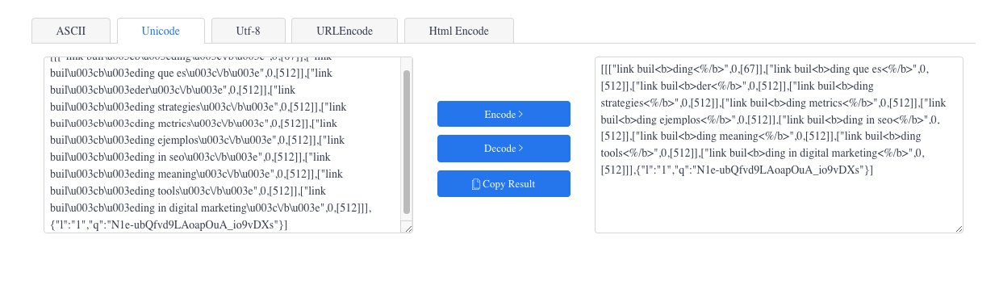

Cuando se habla de scraping, casi siempre salen XPATH, CSS o RegEx, pero hay otra forma de extraer contenido de una web: interceptar las llamadas que la propia web hace a sus servicios. Vamos a usar Google como ejemplo, por motivos prácticos evidentemente.

Para quien no lo tenga claro, el scraping es la práctica de extraer información de una o varias webs. Aunque su legalidad es algo dudosa, lo hacen empresas de todo tipo, y Google es el rey. Googlebot es el bot más activo de internet.

## ¿Cómo se puede hacer scraping sin necesitar el DOM?

### Identifica las llamadas a endpoints

Vamos a usar de ejemplo un script que hice, que extrae datos de Google Autocomplete: [google-autocomplete-extractor](https://github.com/NachoSEO/google-autocomplete-extractor).

Lo primero es ver qué llamadas hace la web cuando ocurren ciertas acciones. En Google, cuando escribes en el buscador y aparece el autocompletado, se lanza una petición para obtener esos datos. Puedes verla en Dev Tools → Network → Fetch/XHR.


### Emula el mismo payload

Una vez identificada la petición, hacemos clic en ella para inspeccionar el payload que envía: el cuerpo que necesita el endpoint para devolvernos los datos del autocompletado.


Para emular esa llamada rápidamente, haz clic derecho sobre la URL y selecciona copy → copy as cURL. Ya tenemos la llamada entera lista para pegar en una terminal.

### Obtén los datos en local con cURL


Pegamos la llamada en la terminal para ver qué elementos necesitamos y cuáles no, y así poder portarla después al lenguaje que prefiramos (Python, NodeJS u otro):

```bash
curl 'https://www.google.com/complete/search?q=link%20building&cp=13&client=gws-wiz&xssi=t&hl=en-ES&authuser=0&psi=<REDACTED>&dpr=2' \
  -H 'authority: www.google.com' \
  -H 'accept: */*' \
  -H 'accept-language: es-ES,es;q=0.9,en;q=0.8' \
  -H 'cookie: <REDACTADO — aquí van tus propias cookies de sesión>' \
  -H 'referer: https://www.google.com/' \
  -H 'user-agent: Mozilla/5.0 (Linux; Android 6.0; Nexus 5 Build/MRA58N) AppleWebKit/537.36 (KHTML, like Gecko) Chrome/110.0.0.0 Mobile Safari/537.36' \
  --compressed
```

El resultado:

```text
)]}'[[["link building",0,[273]],["link building<b> que es<\/b>",0,[512,203]],["link building<b> ejemplos<\/b>",0,[512,203]],["link building<b> seo<\/b>",0,[512,203]],...]
```

Ver la terminal así es un poco como ver Matrix, lo sé. Ahora vamos a cambiar eso. Ejecutamos la petición y la respuesta es una lista de términos en formato Unicode.

## Decodifica el formato Unicode

Para hacerlo legible podemos pasarlo por un conversor. Ahora se ve un poco más claro:



Ya tenemos los datos, ahora vamos a hacerlo escalable con NodeJS.

## Escalando el scraping con NodeJS

Transformamos la petición cURL en Axios (una librería para hacer peticiones). Le pasamos la query de la que queremos información y el idioma, para modificar el atributo `hl`:

```js
async _requestAutocomplete(query, lang) {
  const res = await this.requestRepository.request({
    url: 'https://www.google.com/complete/search',
    method: 'get',
    params: {
      q: query,
      hl: lang,
      authuser: 0,
      cp: 2,
      client: 'gws-wiz',
      xssi: 't',
      psi: '<session-token>',
      dpr: '1'
    },
    headers: {
      // ...
    }
  })
}
```

Como la respuesta viene en Unicode, convertimos y parseamos la salida para obtener una lista limpia de términos. El código completo del parseo está en el [repositorio](https://github.com/NachoSEO/google-autocomplete-extractor).


## Itera cada letra para obtener más datos

Por último, hacemos que el script recorra cada letra del abecedario, extraiga el autocompletado de `query + letter` y guarde el resultado en un archivo `.txt`:

```js
async execute(query, lang) {
  const dataP = this.abc.map(letter => {
    return this._requestAutocomplete(`${letter} ${query}`, lang)
  })
  const data = await Promise.all(dataP)
  const queries = this._parse(data)
  this.fileRepository.saveToFile('./src/output/queries.txt', queries.join('\n'))
}
```

Añadimos la lectura de argumentos desde la terminal y listo: una fuente de keyword research directa del endpoint de Google, sin DOM.
